<!--  -->

<!-- بسم الله الرحمان الرحیم -->

### پژوهش در عصر هوش مصنوعی

### فرصت‌ها و چالش‌ها

**محمود امین‌طوسی**
دانشکده علوم ریاضی - دانشگاه فردوسی مشهد

[mamintoosi.github.io](https://mamintoosi.github.io/)

<!-- _footer: گروه علوم کامپیوتر   -->
<!-- _paginate: false -->

---

## تمام تصاویر و ویدئوهای این ارائه که در آن تصویر اینجانب آمده است با هوش مصنوعی مولد و فقط با دادن این عکس و دستور متنی تولید شده‌اند

---

## سرفصل‌های ارائه

1. هوش مصنوعی مولد: انقلاب در پژوهش
2. ابزارهای هوش مصنوعی برای پژوهش
3. مهندسی پرامپت: کلید استفاده موثر
4. فرصت‌ها در علوم کامپیوتر
5. چالش‌ها و ملاحظات اخلاقی

---

## بخش اول

## هوش مصنوعی مولد: انقلاب در پژوهش

---

| گذشته:            | امروز:                  |
| :---------------- | :---------------------- |
| جستجو در Google   | دستیارهای هوشمند پژوهشی |
| مطالعه صدها مقاله | خلاصه‌سازی خودکار       |
| نگارش دستی        | کمک در نگارش و ویرایش   |
| کدنویسی از صفر    | تولید کد با AI          |

---

<!-- html -->

  

    <video 
      controls 
      style="
        width: 100%;
        height: 70vh; 
        border-radius: 12px;
        box-shadow: 0 6px 20px rgba(0,0,0,0.25);
        background: #000; 
        object-fit: contain; 
      ">
      <source src="img/Research-Accelerator.mp4" type="video/mp4">
      مرورگر شما از تگ ویدئو پشتیبانی نمی‌کند.
    </video>
  

---

### هوش مصنوعی مولد چیست؟

- **تعریف:** مدل‌هایی که براساس الگوهای یادگرفته‌شده از داده‌ها، محتوای جدید «تولید» می‌کنند

- مانند یک نویسنده، نقاش، یا برنامه‌نویس

| نام مدل | شرکت/توسعه‌دهنده | وب‌سایت |
| :--- | :--- | :--- |
| **ChatGPT** | OpenAI | [chatgpt.com](https://chatgpt.com) |
| **Claude** | Anthropic | [anthropic.com/claude](https://www.anthropic.com/claude) |
| **Gemini** | Google | [gemini.google.com](https://gemini.google.com) |
| **DeepSeek** | DeepSeek (چین) | [chat.deepseek.com](https://chat.deepseek.com) |
| **Grok** | xAI | [grok.com](https://grok.com) |
| **GLM (Z.AI)** | Zhipu AI (چین) | [z.ai](https://z.ai) |
                                                       |

---

خروجی جمینای
| دسته مدل | مدل‌های منتخب | مرجع بنچمارک |
| :--- | :--- | :--- |
| **مدل‌های زبانی** | GPT-4o, Gemini 1.5 Pro | [LMSYS Chatbot Arena](https://chat.lmsys.org/?leaderboard) |
| **متن به تصویر** | FLUX.1 [pro], Midjourney v6 | [Artificial Analysis](https://artificialanalysis.ai/models/text-to-image) |
| **توصیف تصویر** | Florence-2, Qwen2-VL | [OpenVLM Leaderboard](https://huggingface.co/spaces/opencompass/open_vlm_leaderboard) |
| **متن به ویدئو** | Runway Gen-3, Kling AI | [Video Gen Leaderboard](https://huggingface.co/spaces/ArtificialAnalysis/Video-Generation-Leaderboard) |
| **مدل‌های چندوجهی** | GPT-4o, Claude 3.5 Sonnet | [MMMU Benchmark](https://mmmu-benchmark.github.io/) |
| **بینایی-زبانی** | InternVL2, Qwen2-VL | [OpenCompass](https://huggingface.co/spaces/opencompass/open_vlm_leaderboard) |
| **تخصصی (ریاضی/کد)** | OpenAI o1, Claude 3.5 Sonnet | [Epoch AI](https://epoch.ai/frontiermath), [LiveCodeBench](https://livecodebench.github.io/leaderboard.html) |

<!-- ---

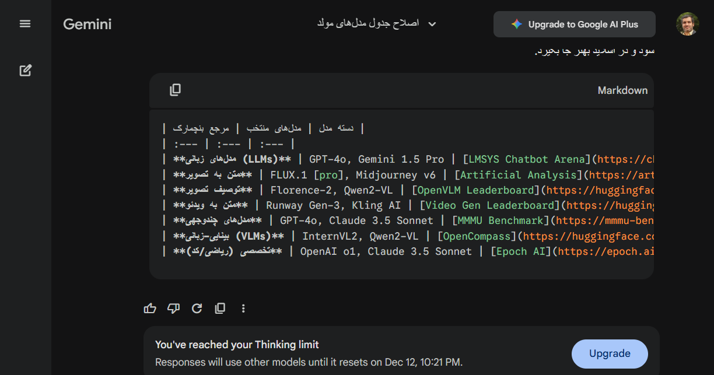 -->

---

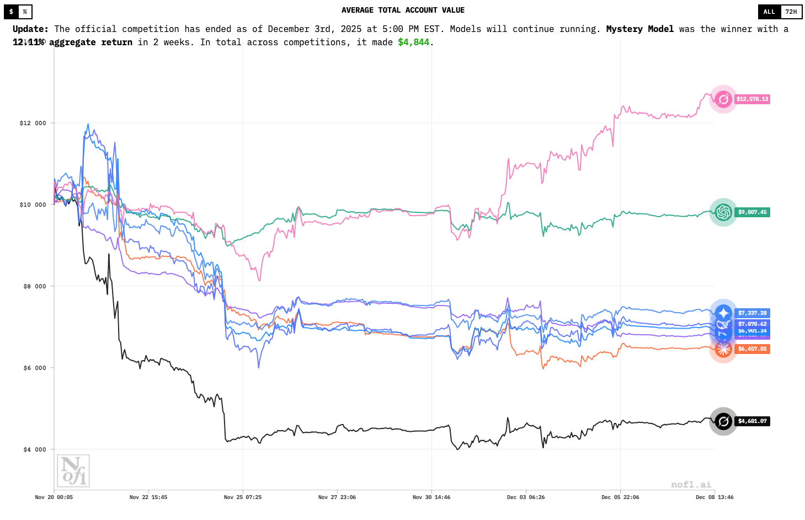

######[AI model Grok 4.2 wins Alpha Arena trading tournament](https://forklog.com/en/ai-model-grok-4-2-triumphs-in-trading-tournament/)

---

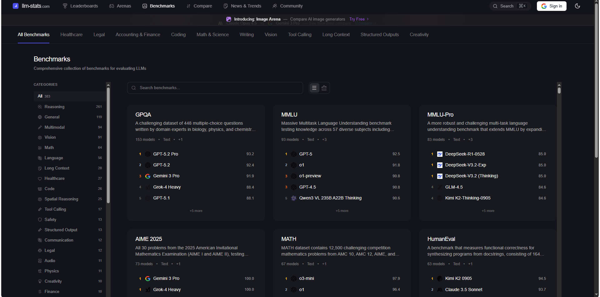

### [llm-stats.com: AI Leaderboards](https://llm-stats.com/)

### [llm-stats.com: Benchmarks](https://llm-stats.com/benchmarks)

---

### مدل‌های «تولید متن از متن» (Text → Text)

| نمونه                                              | کاربرد اصلی                |مالک   |
| -------------------------------------------------- | -------------------------- | --------- |
| [ChatGPT](https://chatgpt.com)                     | گفتگو، کدنویسی، نگارش علمی | OpenAI    |
| [Claude](https://claude.ai)                        | تحلیل عمیق، استدلال متنی   | Anthropic |
| [Gemini](https://gemini.google.com)                | چندوجهی، جستجوی هوشمند     | Google    |
| [DeepSeek](https://chat.deepseek.com)              | استدلال و کدنویسی          | DeepSeek  |
| [Microsoft Copilot](https://copilot.microsoft.com) | دستیار برنامه‌نویسی و آفیس | Microsoft |
| [Grok](https://grok.com)                           | گفتگو با دسترسی به داده‌های X | xAI      |
| [GLM (Z.AI)](https://z.ai)                         | کدنویسی و وظایف تخصصی      | Zhipu AI  |

> این گروه، ستون فقرات ابزارهای پژوهشی مبتنی بر LLM محسوب می‌شود.

---

## تولید تصویر از متن — (Text → Image)

| ابزار                                         | کاربرد / ویژگی                           |
| --------------------------------------------- | ---------------------------------------- |
| [Imagine.art](https://www.imagine.art)        | تولید تصویر فوری، رایگان، مدل‌های تعاملی |
| [Text to Image](https://www.texttoimage.org/) | رایگان                                   |
| [Canva AI](https://www.canva.com)             | تولید سریع تصویر + ابزار طراحی           |
| [Leonardo AI](https://www.leonardo.ai)        | تصویرسازی هنری / مفهومی                  |
| [Dream by Wombo](https://dream.ai/)           | تولید تصویر با سبک‌های هنری              |

---

یک متن فارسی در مورد ترکیبی از خصوصیات سه تن از اساتید را به کوپایلوت دادم و پرامپت مناسب به زبان انگلیسی خواستم که این شد:

###### A cheerful middle-aged professor (around 45 years old) with short beard and salt-and-pepper hair, smiling warmly in his office at Ferdowsi University of Mashhad. His office is decorated with Tintin posters, figurines, and memorabilia, along with many flowers and green plants. A large glass blackboard, gifted by his students, is mounted on the wall, covered with colorful mathematical formulas written in marker. Several students are gathered around him, engaged in lively discussion, showing their admiration for his love of teaching. The office also contains a sofa, desk, chairs, computer, and coffee, creating a cozy and intellectual atmosphere full of energy and inspiration.

---

## خروجی کوپایلوت با GPT-5

---

## خروجی imagine.art با Nano-Banana-Pro

---

 <!-- مقایسه دو ابزار رایگان تولید تصویر با AI -->

- GPT-5 vs Nano Banana Pro
- تفاوت در واقع‌گرایی، وضوح، سبک هنری
- مناسب برای کدام کاربرد؟ (پوستر، ارائه، مقاله، تصویرسازی مفهومی)
- برای اطلاعات بیشتر در مورد شیوه تقلید یک اثر هنری در نقاشی ارائه‌ی قبلی با عنوان [انتقال سبک عصبی](https://1drv.ms/p/c/31166a0f5c94f268/EWjylFwPahYggDGCUwAAAAAB8JI2ARAES9QukZKKiM_EHw?e=qsdToe) را ملاحظه فرمایید

---

---

## تبدیل تصویر به تصویر (Image → Image)

| ابزار                                                          | کاربرد / ویژگی                            |
| -------------------------------------------------------------- | ----------------------------------------- |
| [Fotor AI](https://www.fotor.com/features/ai-image-generator/) | روتوش، حذف اشیاء، تبدیل سبک عکس           |
| [Photopea](https://www.photopea.com)                           | ویرایشگر آنلاین رایگان با فیلترهای هوشمند |
| [Canva AI](https://www.canva.com)                              | تغییر خودکار سبک، پس‌زمینه، رنگ‌ها        |
| [Pixlr AI](https://pixlr.com)                                  | اصلاح و انتقال سبک                        |

<!-- > این ابزارها برای ترمیم، تغییر سبک و بهبود کیفیت تصاویر موجود مناسب‌اند. -->

---

## تولید ویدئو از متن (Text → Video)

| ابزار                                                        | کاربرد / ویژگی                                     |
| ------------------------------------------------------------ | -------------------------------------------------- |
| [MovieFlow](https://movieflow.ai/signup?inviteCode=ZCKDT14H) | تولید ویدئوهای کوتاه با استایل سینمایی، پلن رایگان |
| [Hailuo AI Video](https://hailuoai.video/)                   | تولید سریع ویدئو از متن، نسخه رایگان دارد          |
| [Luma AI (Dream Machine)](https://lumalabs.ai/dream-machine) | حرکت طبیعی دوربین و اجسام، نسخه رایگان محدود       |
| [Runway Gen-2](https://runwayml.com)                         | تولید ویدئو از متن/عکس، نسخه رایگان محدود          |
| [Pika](https://www.pika.art)                                 | ویدئوهای کوتاه خلاقانه، پلن رایگان                 |
| [Kapwing AI Video](https://www.kapwing.com/ai)               | ساخت کلیپ از متن، ابزارهای ویرایش رایگان           |

<!-- > ابزارهای Text→Video به سرعت در حال پیشرفت‌اند و برای آموزش، پرزنتیشن و تولید محتوای علمی بسیار مناسب شده‌اند. -->

<!-- ---

به عنوان جزیی از موضوع، به نحوه ایجاد همین اسلایدها اشاره می شود

دسته بندی انواع مدلهای زبانی از نظر توانایی های مختلف

https://movieflow.ai/signup?inviteCode=ZCKDT14H

---

 -->

<!-- ---
| | |
|:---:|:---:|
|  |  | -->

<!-- <iframe src="https://example.com"></iframe>

---

<iframe src="http://koaning.io/fluctuating-repetition.html" height="300px" width="100%" frameBorder="0"></iframe> --> -->

---

# برای تولید ویدئو باید با استفاده از مدلهای زبانی سناریو نوشته شود.

---

<!-- html -->

  

    <video 
      controls 
      style="
        width: 100%;
        height: 70vh; 
        border-radius: 12px;
        box-shadow: 0 6px 20px rgba(0,0,0,0.25);
        background: #000; 
        object-fit: contain; 
      ">
      <source src="img/one-year.mp4" type="video/mp4">
      مرورگر شما از تگ ویدئو پشتیبانی نمی‌کند.
    </video>
  

---

## مدل‌های چندوجهی — Multimodal AI Models

### ورودی/خروجی: متن، تصویر، صوت، ویدئو

| مدل                                                      | توانایی / ویژگی کلیدی                        |
| -------------------------------------------------------- | -------------------------------------------- |
| [GPT](https://chatgpt.com)                               | متن + تصویر + صوت؛ مکالمه چندحالته           |
| [Gemini](https://gemini.google.com)                      | پردازش متن، تصویر، صوت و ویدئو در مقیاس بزرگ |
| [Claude](https://claude.ai)                              | تحلیل متن و تصویر با دقت بالا                |
| [Ollama Models](https://ollama.com/library)              | اجرای مدل‌های متن‌باز (LLM / VLM) روی لپ‌تاپ |
| [HuggingFace Multimodal](https://huggingface.co/unsloth) | مجموعه‌ای از مدل‌های رایگان متن-باز          |

مقاله با عنوان [The Llama 3 Herd of Models](https://arxiv.org/abs/2407.21783) حدود پانصد نویسنده دارد!

<!-- > مدل‌های چندوجهی مسیر حرکت به سوی [هوش جامع مصنوعی](https://fa.wikipedia.org/wiki/%D9%87%D9%88%D8%B4_%D8%AC%D8%A7%D9%85%D8%B9_%D9%85%D8%B5%D9%86%D9%88%D8%B9%DB%8C) (AGI-like) را نشان می‌دهند. -->

---

## GitHub Copilot / Copilot Pro

### دسترسی رایگان برای اعضای هیات علمی و دانشجویان دانشگاه‌ها

| قابلیت                 | توضیح                                             |
| ---------------------- | ------------------------------------------------- |
| تکمیل کد هوشمند        | پیشنهاد خط به خط و بلاک‌های کامل کد               |
| تولید تست (Unit Tests) | ساخت تست‌های خودکار برای کلاس‌ها و توابع          |
| تبدیل زبان‌ها          | تبدیل کد Python↔CPP↔Java↔C                        |
| توضیح کد               | مستندسازی خودکار کدها                             |
| کمک در تدریس           | تولید مثال‌ها، تمرین‌ها و راهنمایی برای دانشجویان |
| کمک در پژوهش           | پیاده‌سازی سریع ایده‌ها و الگوریتم‌ها             |

---

## لینک‌های رسمی

- [پلن‌ها و قیمت‌ها](https://docs.github.com/en/copilot/get-started/plans)
- [نحوه دریافت رایگان Copilot Pro برای اعضای هیات علمی](https://docs.github.com/en/copilot/how-tos/manage-your-account/get-free-access-to-copilot-pro)
- [اصول پرامپت‌نویسی در Copilot](https://docs.github.com/en/copilot/concepts/prompting/prompt-engineering)
- [بهترین روش‌های استفاده](https://docs.github.com/en/copilot/get-started/best-practices)
- [GitHub Copilot in VS Code](https://code.visualstudio.com/docs/copilot/overview)

<!-- > Copilot Pro یک ابزار کابردی در **پژوهش، آموزش و برنامه‌نویسی** است. -->

> نیازمند تحریم شکن

---

## VSCode

---

<!-- html -->

  
  

    <video 
      autoplay 
      muted 
      controls
      style="
        width: 100%;
        height: 60vh;
        border-radius: 10px;
        box-shadow: 0 5px 15px rgba(0,0,0,0.2);
      ">
      <source src="img/AI_Research_Workflow.mp4" type="video/mp4">
    </video>
    
<strong>Present</strong>

  

    

    <video 
      autoplay 
      muted 
      controls
      style="
        width: 100%;
        height: 60vh;
        border-radius: 10px;
        box-shadow: 0 5px 15px rgba(0,0,0,0.2);
      ">
      <source src="img/Academic_Office_Modern_Morph.mp4" type="video/mp4">
    </video>
    
<strong>  to  </strong>

  

  

    <video 
      autoplay 
      loop 
      muted 
      controls
      style="
        width: 100%;
        height: 60vh;
        border-radius: 10px;
        box-shadow: 0 5px 15px rgba(0,0,0,0.2);
      ">
      <source src="img/Academic_Seasons_Research_Flow.mp4" type="video/mp4">
    </video>
    
<strong>From Past</strong>

  

---
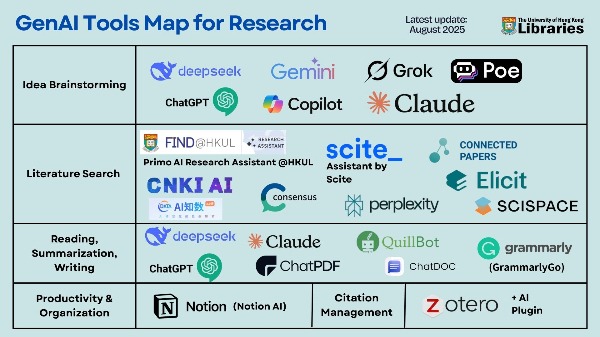
# بخش دوم

## [ابزارهای هوش مصنوعی برای پژوهش](https://libguides.lib.hku.hk/AI-literacy/GenAI4Education)

---

## ابزارهای هوش مصنوعی برای پژوهش علمی

### از جستجو تا مستندسازی و نگارش مقاله

| ابزار                                                | کاربرد اصلی                                          |
| ---------------------------------------------------- | ---------------------------------------------------- |
| [Scinito](https://scinito.ai/)                       | جست‌وجوی دقیق علمی، یافتن مقالات مرتبط               |
| [NotebookLM](https://notebooklm.google.com/)         | ساخت مدل زبانی اختصاصی از PDFها و یادداشت‌های پژوهشی |
| [Gemini](https://gemini.google.com/)                 | تحلیل فایل‌های PDF، استدلال علمی، جستجو              |
| [Connected Papers](https://www.connectedpapers.com/) | شبکه استنادی و یافتن مقاله‌های مشابه                 |
| [Elicit](https://elicit.com/)                        | مرور ادبیات (Literature Review) نیمه‌خودکار          |

> این ابزارها چرخه پژوهش—from idea to publication—را سرعت می‌بخشند.

---

[UM Library](https://library.um.ac.ir/index.php/fa/news-archive-fa/scinito-videos)

[SciNiTO](https://www.scinito.ai/)

---

<!-- html -->

  

    <video 
      controls 
      style="
        width: 100%;
        height: 70vh; 
        border-radius: 12px;
        box-shadow: 0 6px 20px rgba(0,0,0,0.25);
        background: #000; 
        object-fit: contain; 
      ">
      <source src="https://library.um.ac.ir/images/Education/Tutorial_Videos/SCINITOAI/SCiNiTO%20AI-5%20Research%20Chatbot.mp4" type="video/mp4">
      مرورگر شما از تگ ویدئو پشتیبانی نمی‌کند.
    </video>
  

---

## چرخه پژوهش با کمک هوش مصنوعی

<!-- ### Research Workflow with AI -->

| مرحله                        | نقش AI                                                |
| ---------------------------- | ----------------------------------------------------- |
| **۱. ایده‌پردازی**           | یافتن سؤال پژوهشی، بررسی امکان‌پذیری، تولید فرضیه     |
| **۲. جستجوی ادبیات**         | یافتن مقالات کلیدی، گراف استنادی، استخراج شکاف پژوهشی |
| **۳. طراحی آزمایش**          | پیشنهاد روش، تولید کد اولیه، طراحی پروتکل آزمایشی     |
| **۴. تحلیل داده**            | اجرای کد، مصورسازی، تحلیل آماری و مدل‌سازی            |
| **۵. نگارش مقاله**           | نوشتن مقدمه، روش، نتایج، خلاصه‌سازی کل مقاله          |
| **۶. بازبینی علمی**          | نقد بخش‌های مقاله، رفع ابهام، بررسی دستور زبان و منطق |
| **۷. آماده‌سازی برای ارسال** | فرمت‌بندی، تولید کاورلتر، بهبود شکل‌ها                |
| **۸. پاسخ به داوران**        | اصلاح مقاله و آماده‌سازی فایل پاسخ به داوران          |

> AI یک دستیار چند مرحله‌ای در کل فرایند پژوهش است؛ از آغاز تا انتها.

---

## جستجوی ادبیات با ابزارهای هوشمند

### AI-Assisted Literature Review

### ابزارهای اصلی

- **[Scinito](https://scinito.ai/)** – جست‌وجوی دقیق علمی، یافتن مقالات مرتبط بر اساس مفهوم
- **[Connected Papers](https://www.connectedpapers.com/)** – تولید گراف استنادی و تشخیص «مقالات مرتبط»
- **[Elicit](https://elicit.com/)** – مرور ادبیات نیمه‌خودکار با ترکیب LLM و پایگاه‌های واقعی
- **[NotebookLM](https://notebooklm.google.com/)** – ساخت دستیار پژوهشی اختصاصی از چند PDF و یادداشت
  - استفاده از NotebookLM‌ در ایجاد پادکست [درس داده‌کاوی](https://fum-cs.github.io/data-mining/intro.html)

<!-- ### کاربردها

- یافتن مقالات کلیدی (Anchor Papers)
- شناسایی شکاف پژوهشی (Research Gap)
- ساخت گراف ساختار دانش (Knowledge Graph)
- خلاصه‌سازی چندمقاله‌ای و استخراج الگوها

> مرور ادبیات با AI از یک فرآیند چندروزه به یک کار چندساعته تبدیل می‌شود. -->

---

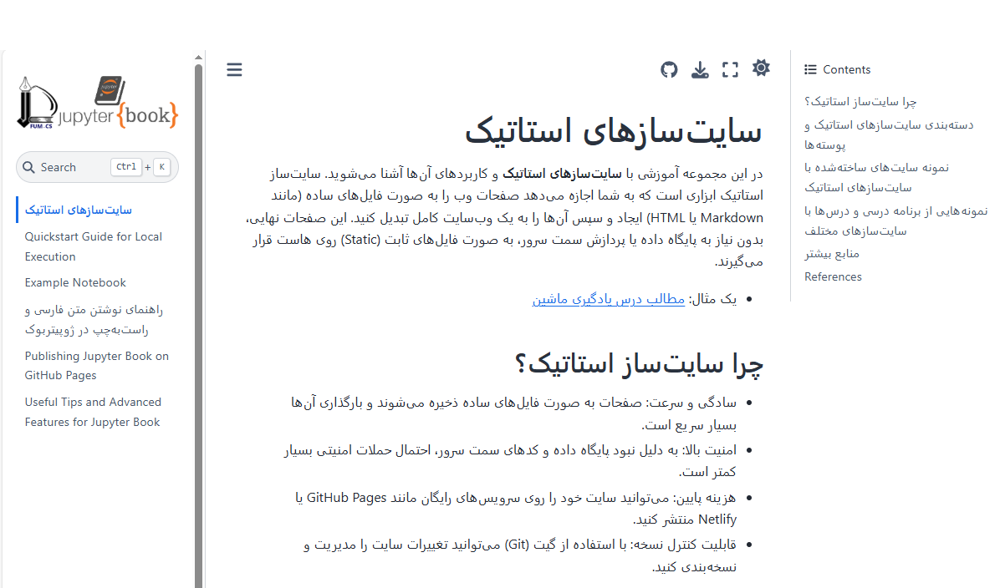

### [آشنایی با Jupyter-Book](https://fum-cs.github.io/jupyter-book-tutorial/docs/home.html)

---

| فرمت / سامانه           | SEO        | LLM        |
| ----------------------- | ---------- | ---------- |
| HTML استاتیک            | عالی       | عالی       |
| RevealJS / Marp HTML    | عالی       | عالی       |
| Hugo / MkDocs / Alfolio | عالی       | عالی       |
| PDF در سایت عمومی       | متوسط      | متوسط      |
| Google Slides (عمومی)   | ضعیف       | ضعیف       |
| Dropbox PDF             | بسیار ضعیف | بسیار ضعیف |
| OneDrive PPT/PDF        | بسیار ضعیف | بسیار ضعیف |
| Moodle / LMS دانشگاهی   | بسیار ضعیف | بسیار ضعیف |

تفاوت روشهای مختلف نشر دانش در دیده شدن

---

<!-- مشکل اصلی با ابزارهای هوش مصنوعی: **عدم قطعیت**!!! -->

## عدم قطعیت در مدل‌های مولد هوش مصنوعی

| واقعیت فنی              | توضیح کوتاه                                     | پیام برای پژوهشگر              |
| ----------------------- | ----------------------------------------------- | ------------------------------ |
| **ماهیت احتمالی**       | خروجی‌ها بر اساس احتمال تولید می‌شوند، نه قطعیت | پاسخ‌ها می‌توانند متفاوت باشند |
| **عدم حقیقت‌سنجی ذاتی** | هدف مدل تولید متن محتمل است، نه صحت علمی        | امکان پاسخ قانع‌کننده ولی غلط  |
| **عدم درک نیت واقعی**   | مدل فقط پرامپت را تفسیر آماری می‌کند            | نیاز به مهندسی پرامپت دقیق     |
| **توهم‌زایی**           | امکان ساخت منبع، عدد یا ادعا                    | ممنوع برای استناد مستقیم       |

**خروجی AI باید همیشه راستی‌آزمایی شود، به‌ویژه در مقاله علمی**

<!-- ### به نتایج هیچ کدام نمی‌توان اطمینان صددرصد درست داشت!!

### یا آنچه می‌خواهیم را نمی‌دهند! -->

---

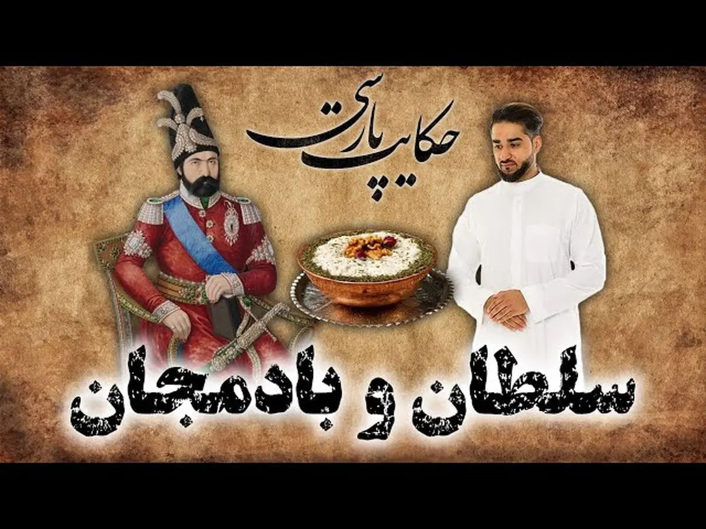

## من ندیم توام نه ندیم بادمجان

«سلطان محمود» را در هنگام گرسنگی «بادمجان بورانی» پیش آوردند، خوشش آمد و گفت: بادمجان طعامی است خوش.
ندیمی در مدح بادمجان فصلی پرداخت و [سلطان محمود] چون سیر شد گفت: بادمجان چیز خیلی مضری است.
ندیم، باز در مضرت بادمجان مبالغتی تمام كرد.
سلطان گفت: ای مردک نه این زمان كه مدحش می‌گفتی؟
گفت: من ندیم توام نه ندیم بادمجان، مرا چیزی باید گفت كه تورا خوش آید نه بادمجان را.

عبید زاکانی ـ رساله دلگشا

---

## جستجو در موتورهای جستجو و سامانه‌های جدید هوشمند

#### جستجوی عبارت:

### "لیست اعضای هیات علمی گروه علوم کامپیوتر دانشگاه فردوسی مشهد"

---

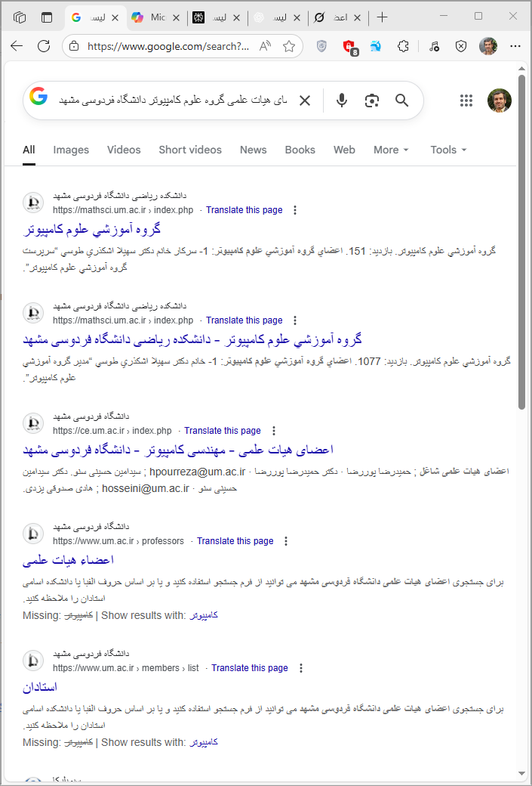
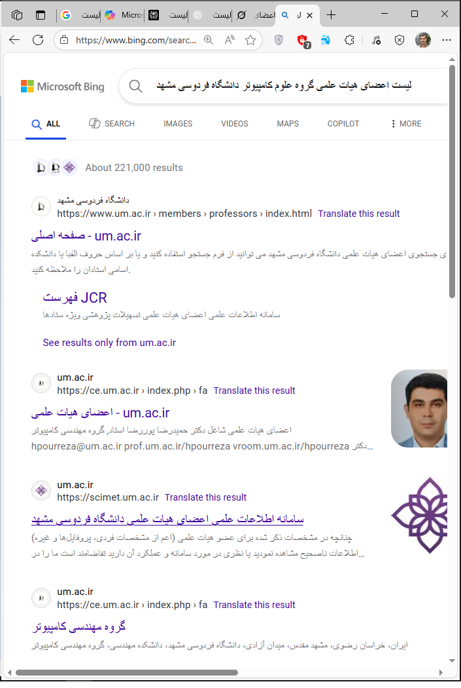

---

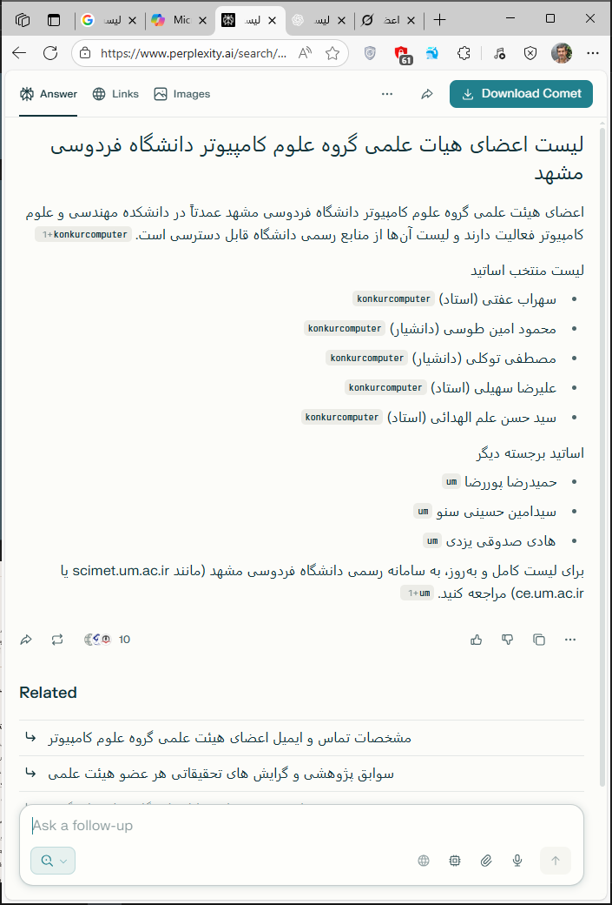

---

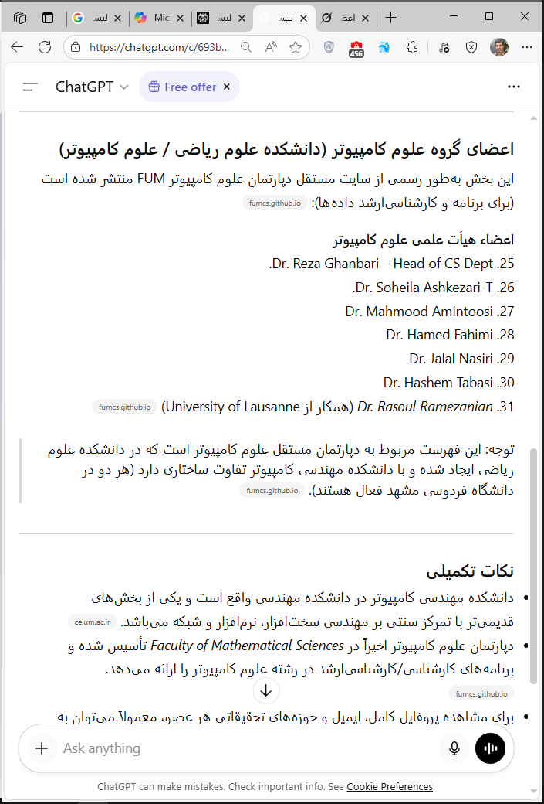

---

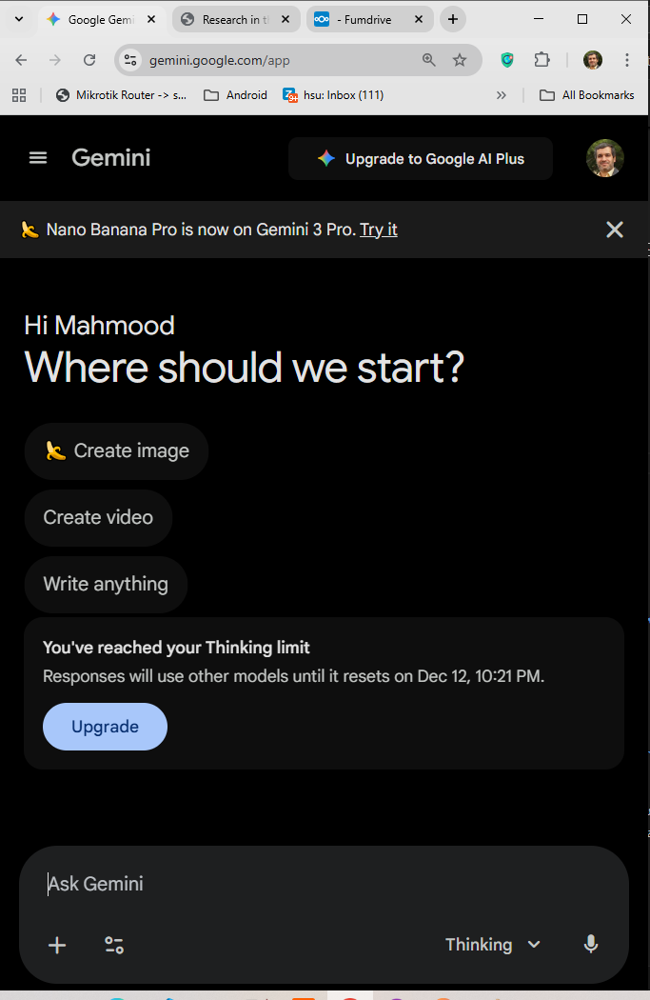
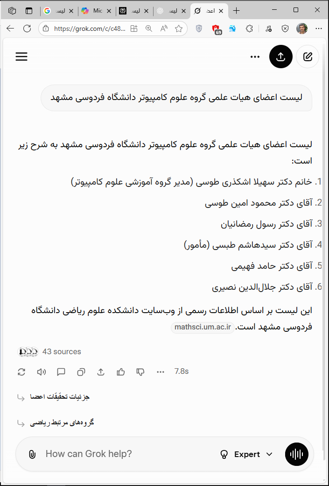

---

### ابزارهای پژوهشی هوشمند چگونه خطای منبع را کاهش می‌دهند؟

| رویکرد           | نحوه کار                                  | میزان اعتماد        |
| ---------------- | ----------------------------------------- | ------------------- |
| **LLM خالص**     | تولید پاسخ صرفاً بر اساس مدل زبانی        | ❌ پایین برای منابع |
| **RAG-based AI** | جستجو در پایگاه داده واقعی + تحلیل با LLM | ✅ بالا برای منابع  |

### معماری ابزارهایی مثل Scinito / Elicit

| مرحله    | توضیح                                                       |
| -------- | ----------------------------------------------------------- |
| 1️⃣ جستجو | بازیابی مقاله از پایگاه‌های واقعی (CrossRef, PubMed, arXiv) |
| 2️⃣ فیلتر | انتخاب مقالات مرتبط با DOI و متادیتا                        |
| 3️⃣ تحلیل | خلاصه‌سازی و خوشه‌بندی با LLM                               |
| 4️⃣ ارائه | لینک واقعی، قابل کلیک و بررسی                               |

### نکته کلیدی

> **منابع واقعی‌اند، اما تفسیر آن‌ها همچنان نیازمند قضاوت انسانی است**

<!-- ---

# بخش سوم

## مهندسی پرامپت: کلید استفاده موثر

---

<!-- html -->

<h2> بخش سوم</h2>
<h3> مهندسی پرامپت: کلید استفاده موثر از مدلهای هوش مصنوعی</h3>
  

    <video 
      controls 
      style="
        width: 100%;
        height: 70vh; 
        border-radius: 12px;
        box-shadow: 0 6px 20px rgba(0,0,0,0.25);
        background: #000; 
        object-fit: contain; 
      ">
      <source src="img/From-Traditional-Research-to AI-Powered-Acceleration.mp4" type="video/mp4">
      مرورگر شما از تگ ویدئو پشتیبانی نمی‌کند.
    </video>
  

---

## چرا پرامپت‌نویسی مهم است؟

### 🎯 پرامپت = دستورالعمل شما برای AI

- **دقت خروجی:** پرامپت خوب = پاسخ دقیق و مفید
- **کنترل نتیجه:** شما «مهندس» گفتگو هستید
- **بهینه‌سازی:** پرامپت ضعیف = پاسخ بی‌ربط

### [اسلایدهای آماده شده با کمک جمینای ](https://docs.google.com/presentation/d/1IZw3Rj7w47ZrtogpjayEacRhTEoO1YqWHGNgzWMRnjc/edit?usp=sharing) 

---

### چارچوب پرامپت حرفه‌ای

| مؤلفه               | توضیح مختصر             | نمونه                                            |
| ------------------- | ----------------------- | ------------------------------------------------ |
| **Persona (شخصیت)** | تعیین نقش یا تخصص AI    | «تو یک محقق یادگیری ماشین هستی.»                 |
| **Context (زمینه)** | ارائه اطلاعات پیش‌زمینه | «در حال نوشتن بخش کارهای مرتبط درباره CNN هستم.» |
| **Task (وظیفه)**    | مشخص‌کردن کار اصلی      | «۱۰ مقاله کلیدی را فهرست کن.»                    |
| **Format (قالب)**   | شکل خروجی               | «نتیجه را در قالب جدول LaTeX بده.»               |
| **Tone (لحن)**      | سبک و لحن متن           | «لحن رسمی، علمی و دقیق باشد.»                    |
| **Exemplar(نمونه)** | نمونه ورودی/خروجی       | «چند مثال برای تقلید ارائه می‌دهم.»              |

> ساختاردهی صحیح پرامپت کیفیت خروجی مدل‌های زبانی را چند برابر افزایش می‌دهد.

<!-- ###### Professional Prompt Engineering (P–C–T–F–T–E) -->

---

## نکات کلیدی مهندسی پرامپت

| موضوع                             | نکته کاربردی (خلاصه)                                                               |
| --------------------------------- | ---------------------------------------------------------------------------------- |
| **مرحله‌به‌مرحله (Step-by-step)** | خروجی را گام به گام بخواهید                                                        |
| **جداکننده‌ها (Delimiters)**      | برای مشخص‌کردن متن هدف از جداکننده سه‌گانه استفاده کنید:  `"""متن شما اینجا"""` |
| **Few-shot (نمونه‌های آموزشی)**   | چند مثال مطلوب نشان بدهید تا قالب موردنظر را یاد بگیرد. (۲–۳ مثال کافی است)        |
| **توسعه تکراری (Iterate)**        | پرامپت را اجرا کن ← خروجی را آنالیز کن ← پرامپت را اصلاح کن ← مجدداً اجرا کن.      |

---

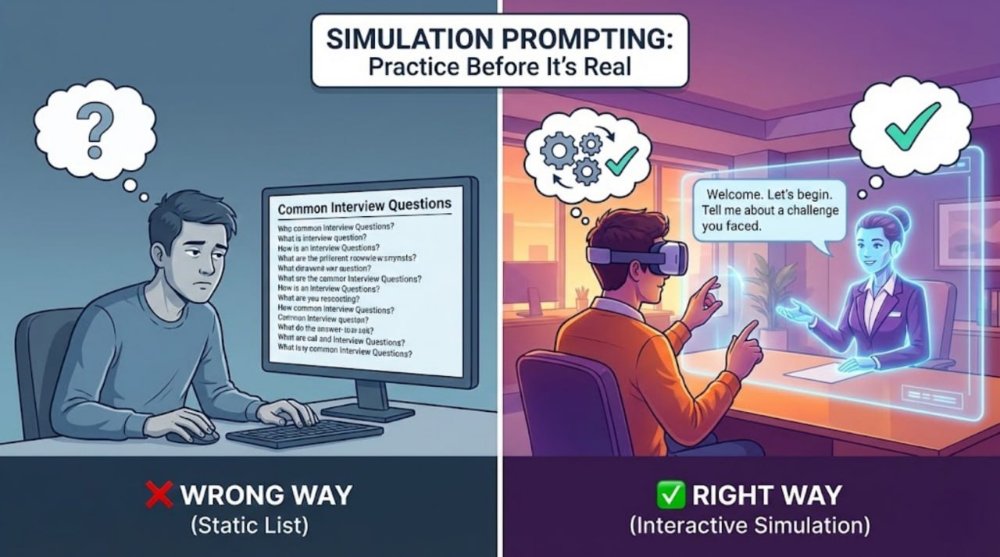

⭐ تکنیک شبیه‌سازی: (برگرفته از [کانال هوش‌مصنوعی در پژوهش،](http://t.me/ai_in_research))

چرا فقط درباره «مصاحبه کاری» یا «دفاع پایان‌نامه» سوال می‌پرسی وقتی می‌تونی واقعاً تجربه‌ش کنی؟ 😎

🔵 تکنیک «شبیه‌سازی» (Simulation)، هوش مصنوعی رو از یه «موتور جستجو» تبدیل می‌کنه به یه «شبیه ساز تمرینی»

به جای اینکه لیست سوالات رو بگیری، بهش بگو محیط رو برات بازسازی کنه! بهش بگو نقش طرف مقابل (استاد راهنما، مشتری عصبانی، مصاحبه‌گر گوگل) رو بازی کنه و یکی‌یکی ازت سوال بپرسه.

<!-- ❌ روش غلط (متنی):
«سوالات رایج در جلسه دفاع پایان‌نامه ارشد روانشناسی چیست؟» (نتیجه: یه لیست خشک و خالی که فقط می‌خونی.) -->

✅ مثال:
«می‌خواهم جلسه دفاع پایان‌نامه‌ام را تمرین کنم. تو نقش "استاد داور سخت‌گیر" را بازی کن. موضوع من "هوش مصنوعی در روانشناسی" است. جلسه را شروع کن و سوالات را دانه دانه از من بپرس و منتظر جوابم بمان. بعد از هر جواب، نظر بده و سوال بعدی را بپرس.»

🔹 ما را دنبال کنید:
تلگرام (https://t.me/AI_IN_RESEARCH) | یوتیوب (http://youtube.com/@AI_in_Research) | اینستاگرام (http://instagram.com/AI_in_Research) | سایت (https://aiinresearch.ir/) | دوره‌ها (https://t.me/AI_in_Research_Shop)
هوش‌مصنوعی در پژوهش، (http://t.me/AI_in_Research) بروزترین ارائه دهنده خدمات #هوش‌مصنوعی در ایران

---

## مثال مثلاً واقعی

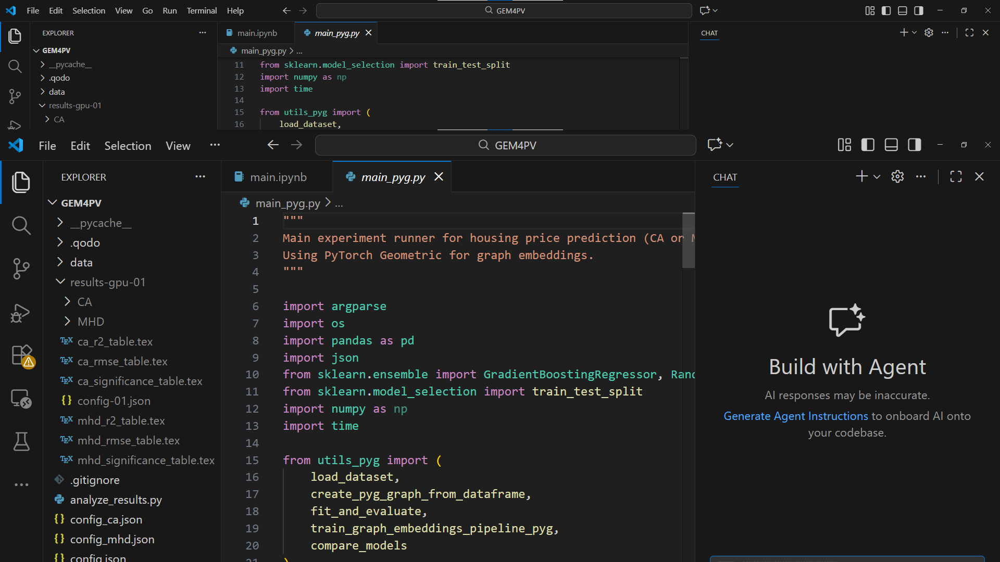

---

# پرامپت اول:

این مخزن شامل برنامه هایی هست که برای بررسی امکان استفاده از «تعبیه سازی گراف» در ارزش گذاری قبمت املاک نوشته ام و بر روی دو مجموعه داده اجرا شده است.
فایل اصلی 'main_pyg.py' هست که در 'main.ipynb'
بر روی مجموعه دادگان مختلف فراخوانی شده و نتایح اجرای قبلی در پوشه
'results-gpu' ذخیره شده است.
ابتدا مخزن را بررسی کن و یک گزارش در مورد روند کار و ورودی ها و خروجی ها بده که مطمئن شوم روال کار را متوجه شده‌ای

---

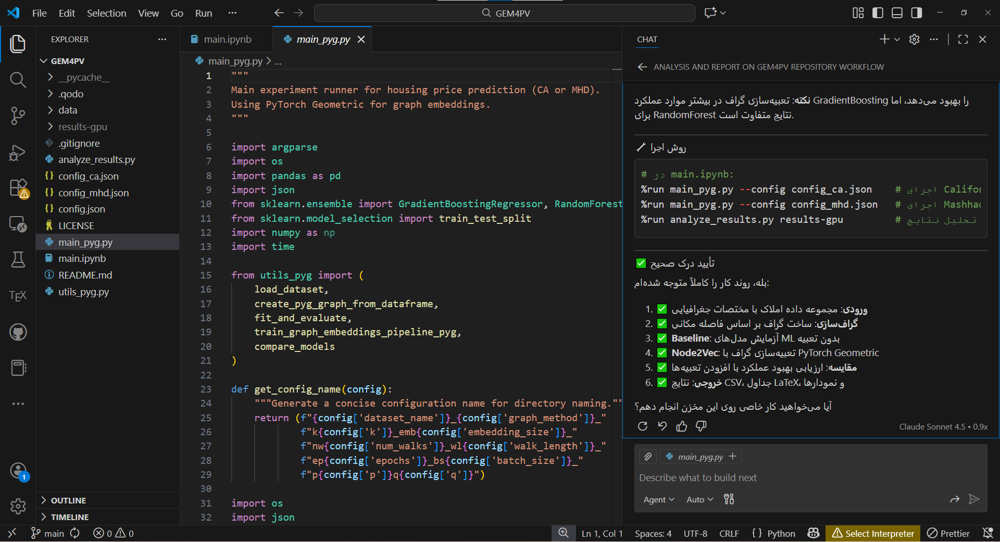

---

<!-- html -->

  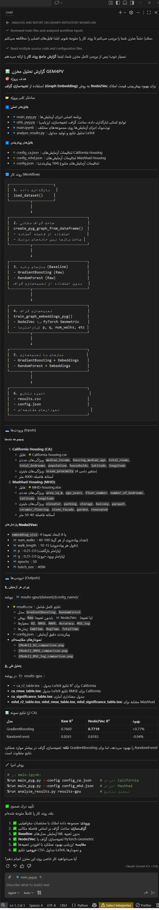

  🔽 برای دیدن جزئیات به پایین اسکرول کنید

---

### پیشنهاد عنوان مقاله

<!-- شما اکنون به کل این مخزن کد دسترسی دارید و ساختار پروژه، هدف آن، روش‌ها و نتایج قابل استخراج از کد را تحلیل کرده‌اید. لطفاً با توجه به محتوای این مخزن، چند عنوان دقیق، فنی، و مناسب برای یک مقاله پژوهشی در حوزه مرتبط پیشنهاد بده. عناوین باید به زبان انگلیسی باشند و بازتاب‌دهنده نوآوری‌ها، هدف پروژه، و روش پیاده‌سازی موجود در این کد باشند. لطفاً 3 تا 5 عنوان پیشنهادی ارائه کن.

--- -->

<!-- html -->

  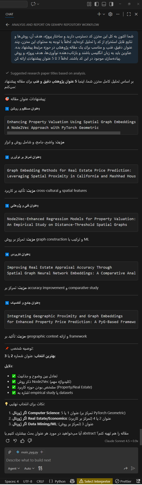

  🔽 برای دیدن جزئیات به پایین اسکرول کنید

---

<!-- html -->

 عنوان 2 را انتخاب  می کنم، لطفاً یک درفت اولیه با لاتک از یک مقاله پژوهشی به زبان انگلیسی تولید کن.

- مشخصات نویسنده:‌ Mahmood Amintoosi,
  Ferdowsi University of Mashhad, Computer Science Dept.

- ساختار مقاله باید شامل بخش‌های زیر باشد:

1. Abstract 2. Introduction 3. Proposed Method 4. Experimental Results

- متن مقاله رسمی، آکادمیک، و استاندارد باشد. از محتواهای موجود در کد، فایل‌ها، ساختار پروژه، منطق پیاده‌سازی، و نوآوری‌های آن برای نوشتن مقاله استفاده کن. در صورت لزوم، معماری یا روش‌ها را به‌صورت منسجم بازنویسی کن تا متن مقاله روان و علمی باشد.

- فایلهای نتایج - تصاویر و فایلهای لاتک جداول مقایسات - در پوشه 'results-gpu' موجود است.

- یک پوشه با نام docs ایجاد کن و فایل لاتک مقاله به همراه فایلهای احتمالی مورد نیاز را در آن قرار بده.

- پیشنهاد می کنم به نتایج تولید شده در همان مسیرها که هستند لینک بدهی که در صورت اجرای مجدد، با پردازش مجدد فایل لاتک، نتایج جدید در مقاله قرار داده شوند.

- هدف من آموزشی است، بنابراین نیازی به ارائه جزئیات بسیار پیچیده نیست؛ فقط یک پیش‌نویس منظم، حرفه‌ای، و آکادمیک ارائه بده.

- بعد از نوشتن مقاله، pdflatex را روی سند اجرا کن (در مسیر سیستم من هست).

---

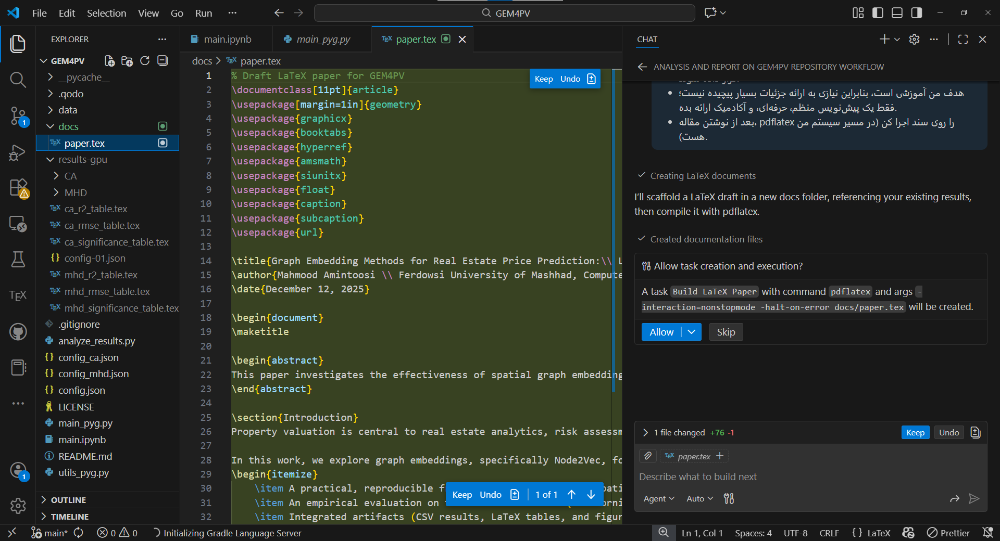

---

---

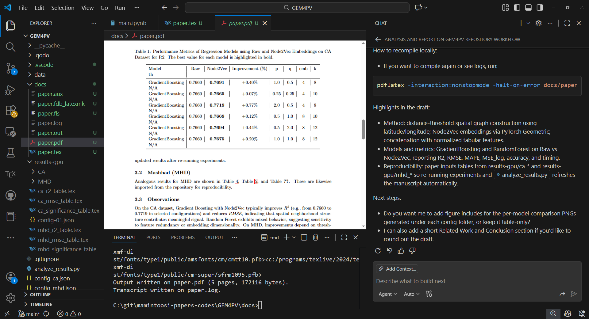

---

یک مجله مناسب برای ارسال
این مقاله پیشنهاد بده و یک
Cover Letter
برای آن در قالب لاتک آماده کن.

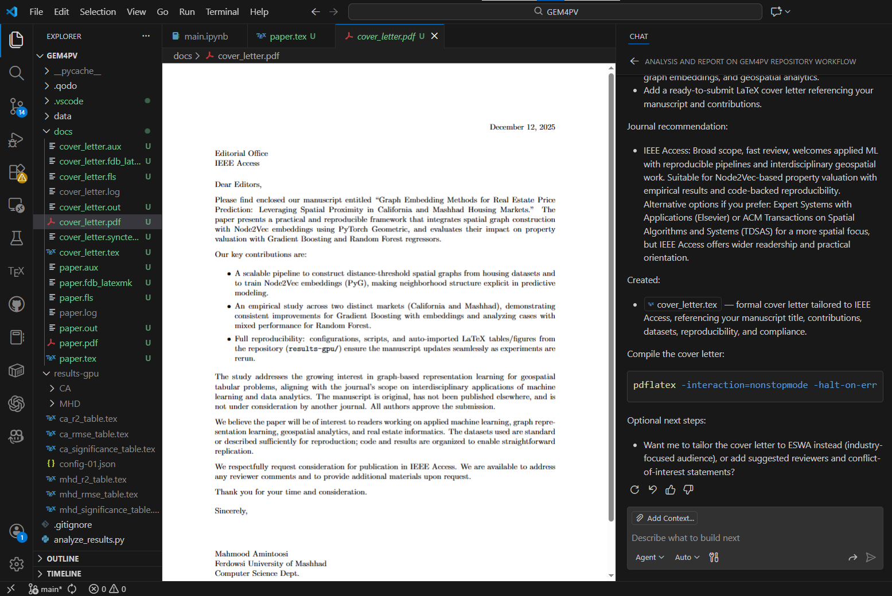

<!-- ---
به عنوان یک داور  رشته کامپیوتر دو پیشنهاد جزیی برای بهبود مقاله (به زبان  انگلیسی) بده به نحوی که بدون نیاز به اجرای برنامه ها قابل پاسخ دادن و اعمال در مقاله باشند، مثلا اضافه کردن نتیجه‌گیری یا اضافه کردن
چند مرجع -->

---

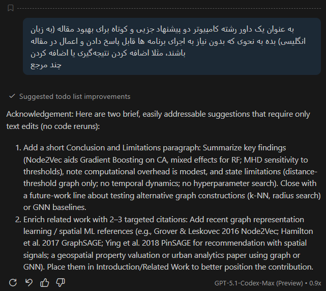

<!-- ---
حالا در پاسخ به ایرادات/پیشنهادات داور:

الف) مقاله را به منظور انجام اصلاحات خواسته شده،‌ویرایش کن و نسخه جدید را در فایلی با نام مناسب قرار بده.
ب) پاسخ به داور را به صورتی که در ادامه خواهم گفت آماده کن.
ج) یک پوشه جدید با نام مناسب ایجاد کن و نسخه جدید و پاسخ به داور را در آن قرار بده.

مواردی که درخصوص پاسخ به داور باید درنظر گرفته شود:

1. یک فایل LaTeX کامل با یک قالب استاندارد و حرفه‌ای برای «پاسخ نویسندگان به داوران» تولید کن.
 فایل باید به صورت کامل و قابل کامپایل باشد (دارای preamble، بسته‌های لازم، title، بخش‌بندی و ...).
2. برای هر نظر داور، دو محیط مجزا طراحی کن:
   - محیطی با عنوان "Reviewer Comment" برای درج نظر داور
   - محیطی با عنوان "Author Response" برای پاسخ نویسندگان
3. این دو محیط باید از نظر بصری کاملاً متمایز باشند (مثلاً با رنگ، کادر، یا محیط تئوری).
4. پیشنهادات داور و پاسخ نویسندگان را در فایل قرار بده.
5. زبان متن داخل فایل LaTeX باید انگلیسی باشد. -->

---

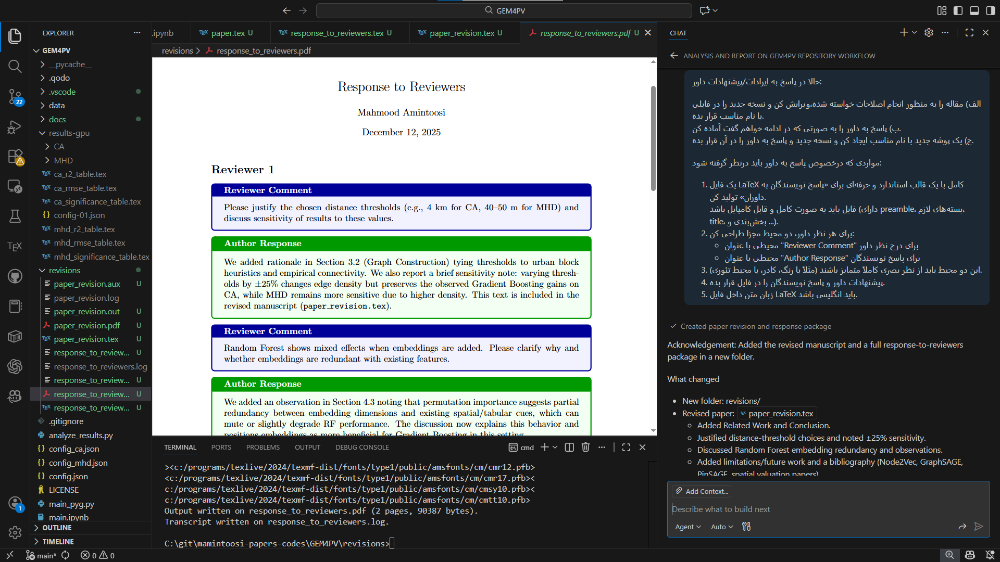

---
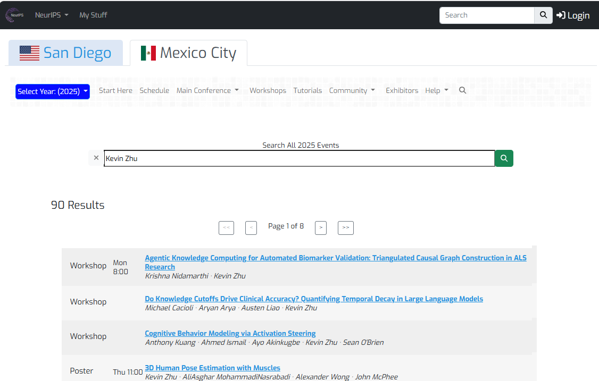
## مثلا ما خوشحالیم که مقاله آماده شد 😃

اما

- نظراتی که برای داور نوشته همون نظرات داور نیستند!
- نمی‌توانیم مطمئن باشیم که بخشهای اصلی مقاله خراب نشده باشند!
- ملت دارن با سرعت مقاله می‌نویسن و حتما در صفی طولانی قرار خواهیم گرفت!
  * [Kevin Zhu](https://neurips.cc/virtual/2025/search?query=Kevin+Zhu)

---

<!-- html -->

<h2> بخش چهارم
</h2>
<h3>
 فرصت‌های هوش مصنوعی در علوم کامپیوتر
 </h3>
  <video 
    autoplay 
    loop 
    muted 
    controls 
    style="
      max-height: 70%;
      width: auto;
      max-width: 70%;
      border-radius: 12px;
      box-shadow: 0 6px 20px rgba(0,0,0,0.25);
    ">
    <source src="img/Classical-Academic-Researcher.mp4" type="video/mp4">
    مرورگر شما از تگ ویدئو پشتیبانی نمی‌کند.
  </video>

---

### ابزارهای هوش مصنوعی در علوم/مهندسی کامپیوتر

| حوزه | کاربردهای کلیدی | نمونه ابزارها |
|------|------------------|----------------|
| **تسریع کدنویسی** | تکمیل کد، دیباگ، بازنویسی تمیز، پیشنهاد معماری، Unit Test | [GitHub Copilot](https://github.com/features/copilot)، [Cursor](https://cursor.sh)، [Codex](https://platform.openai.com/docs/models/codex) |
| **تحلیل داده** | تولید کد تحلیل، پیشنهاد روش آماری، نمودار و گزارش | [ChatGPT](https://chatgpt.com)، [NotebookLM](https://notebooklm.google)، [Claude](https://claude.ai) |
| **نمونه‌سازی سریع** | ساخت سریع MVP، front/back اولیه | [Lovable](https://lovable.dev)، [Qudo](https://qudo.ai) |
---

## نمونه کاربردهای عملی AI در پروژه‌های کامپیوتری

- تولید نسخه اولیه (Prototype) از **backend** و **frontend** تنها با توصیف متنی
- تولید APIهای اولیه، مستندات، و تست‌های خودکار
- تبدیل ایده به شبه‌کد و به کد قابل‌اجرا
- ایجاد اسکریپت‌های کامل برای پیش‌پردازش داده
- پیشنهاد معماری مناسب برای مدل‌های یادگیری ماشین
- تولید گزارش تحلیلی از داده‌ها + توضیح نمودارها

> AI بهترین ابزار برای توسعه سریع نمونه اولیه در پروژه‌های دانشجویی و پژوهشی است.

---
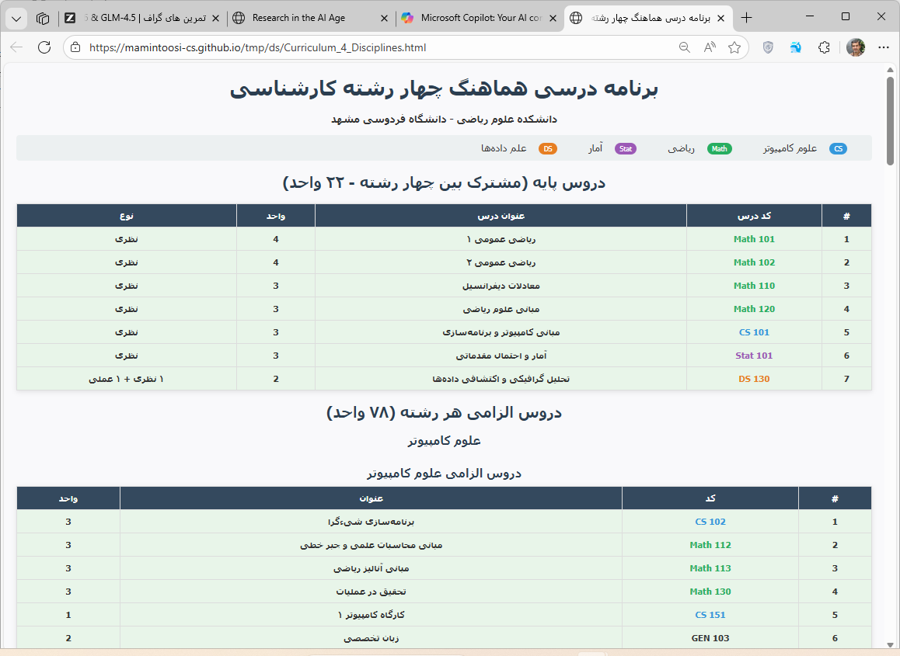
## [جدول پیشنهادی دروس  رشته‌های دانشکده علوم ریاضی](https://mamintoosi-cs.github.io/tmp/ds/Curriculum_4_Disciplines.html)

---
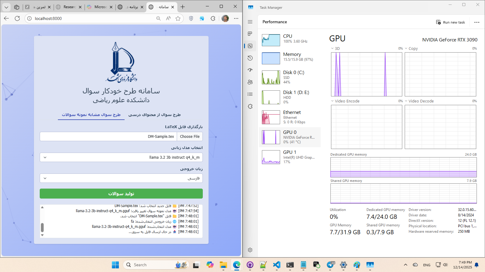

## [سامانه طرح سؤال از مطالب درسی](https://github.com/sirnaser/modern-qg)

---
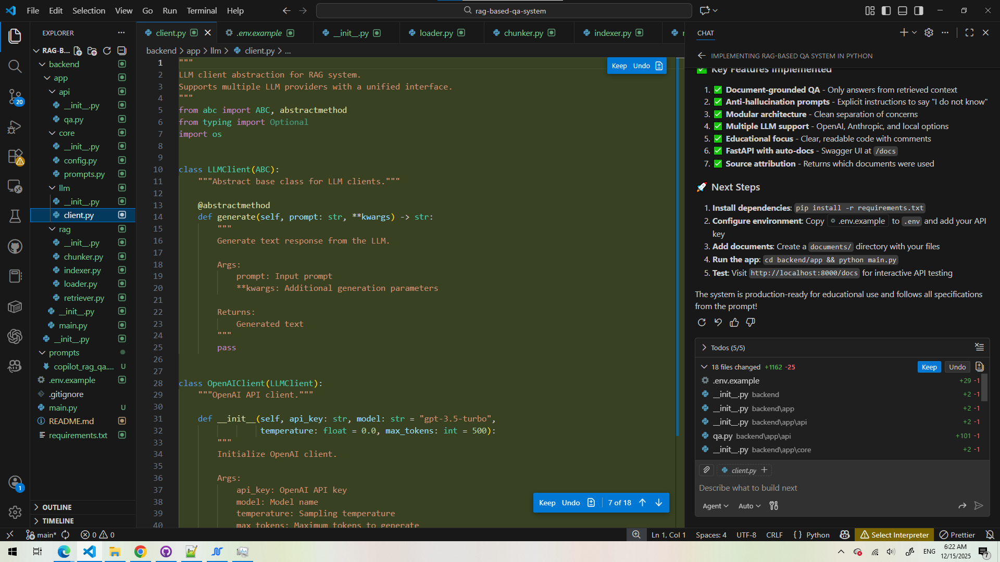

## سامانه پاسخگویی مبتنی بر RAG

در این پروژه، یک سامانه پاسخ‌گویی به پرسش مبتنی بر RAG طراحی و پیاده‌سازی شده است که به جای اتکا به دانش ضمنی مدل زبانی، ابتدا بخش‌های مرتبط از اسناد ورودی را بازیابی کرده و سپس پاسخ را فقط بر اساس همان شواهد تولید می‌کند.
کل سیستم، شامل بک‌اند، API و رابط کاربری وب، به‌صورت یکپارچه در محیط VSCode و با هوش مصنوعی مولد
توسعه داده شده است.

---
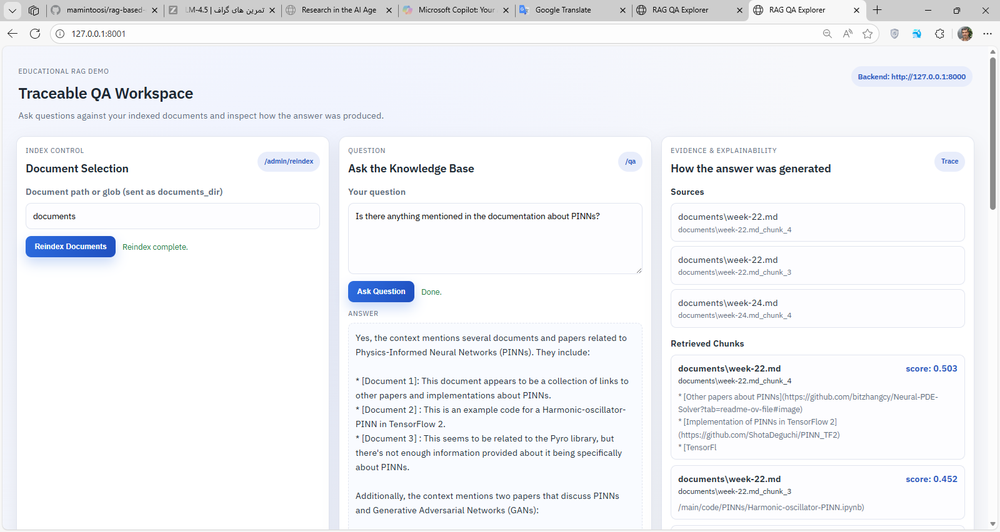
<!-- رابط کاربری امکان انتخاب مسیر اسناد، طرح پرسش، و مشاهده پاسخ به همراه شواهد و مراحل پردازش (retrieval، prompt و مدل) را فراهم می‌کند -->

---
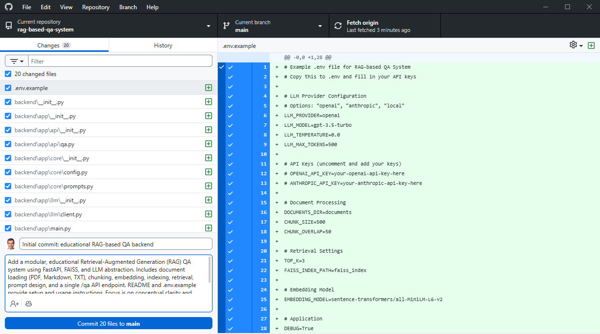

---

## چالش‌ها و ملاحظات اخلاقی در استفاده از هوش مصنوعی

<!-- html -->

| چالش                          | توضیح مختصر                                 | راه‌حل‌های کلیدی                                                    |
| ----------------------------- | ------------------------------------------- | ------------------------------------------------------------------- |
| **توهم‌زایی (Hallucination)** | تولید اطلاعات ساختگی، ارجاعات و آمار نادرست | راستی‌آزمایی، تطبیق چندمنبعی، درخواست شفاف‌سازی از مدل              |
| **سوگیری (Bias)**             | بازتاب سوگیری موجود در داده‌های آموزشی      | استفاده از چند مدل، بررسی خروجی، تنظیم دقیق درخواست                 |
| **عدم تبیین‌پذیری**           | فرایند تصمیم‌گیری مدل روشن نیست             | ساده‌سازی مسئله، تست سناریوها، استفاده از مدل‌های قابل‌توضیح‌تر     |
| **محرمانگی داده**             | احتمال نشت اطلاعات حساس                     | حذف داده شخصی، فعال‌سازی حالت Private، استفاده از نسخه‌های محلی     |
| **وابستگی بیش‌ازحد**          | تضعیف مهارت تحلیل و تفکر پژوهشگر            | استفاده تکمیلی (نه جایگزین)، بازنگری انسانی، مستندسازی              |
| **مالکیت فکری و انتساب**      | ابهام در اینکه چه چیزی «اثر شما» است        | ذکر استفاده از AI، ذخیره نسخه‌های میانی، بررسی محدودیت‌های کپی‌رایت |

---

## جمع‌بندی

| نکته                                 | توصیه عملی                                                    |
| ------------------------------------ | ------------------------------------------------------------- |
| **AI ابزار قدرتمند است، نه جایگزین ما** | از آن برای سرعت و کیفیت استفاده کنید، نه برای حذف تفکر انسانی |
| **اهمیت کلیدی مهندسی پرامپت**   | پرسونا + زمینه + وظیفه + قالب ← خروجی بهتر                    |
| **فرصت‌های گسترده**                  | کدنویسی، تحلیل داده، نگارش، کاوش ادبیات، تولید ایده           |
| **چالش‌های اخلاقی واقعی هستند**      | سوگیری، توهم‌زایی، محرمانگی ← نیازمند کنترل و راستی‌آزمایی    |
| **تفکر انتقادی ضروری است**           | هیچ خروجی مدل بدون بررسی نهایی قابل اعتماد نیست               |

AI را دستیار پژوهشی خود ببینید؛ قدرت تحلیل، خلاقیت و قضاوت علمی همچنان در دست شماست.

---

<!-- # با تشکر از توجه شما 🙏

## پرسش و پاسخ -->

Thanks
_M. Amintoosi_
**.FUM, CS. Dept**

<!-- [mamintoosi.github.io](https://mamintoosi.github.io/)
[mamintoosi.github.io/presentations](https://mamintoosi.github.io/presentations/) -->
<!-- ---

مثالهایی که باید اضافه کنم:

- هر ابزاری برای جایی
  - پاورپوینت، لاتک، HTML, Jupyer-book, Marp, Google docs
  - همین ارائه و ارائه های قبلی
- تبدیل ارائه NST‌ به مقاله
- نوشتن پیش نویس مقاله تخمین تابع چگالی احتمال
- استنتاج ریاضی: فرمول Image Matting
- مارک داون
- Time-line
- برنامه درسی مشترک دانشکده -->

---

حتی نتایج گوگل هم ممکن است اشتباه باشد!

---

|                                              |                                                |
| :------------------------------------------: | :--------------------------------------------: |
|  |  |

---

## چالش‌ها: وابستگی بیش‌ازحد و تعصبات — خلاصه در یک نگاه

| چالش                 |                                                                                                                                                                                     مشکل کوتاه | راه‌حل سریع                                                                                                                                     |
| -------------------- | ---------------------------------------------------------------------------------------------------------------------------------------------------------------------------------------------: | ----------------------------------------------------------------------------------------------------------------------------------------------- |
| **وابستگی بیش‌ازحد** | کاهش تفکر انتقادی؛‌ افت مهارت‌های پایه؛ درک سطحی موضوع. (نمونه: استفاده مداوم از ChatGPT). [پیوست نمونه](https://www.linkedin.com/posts/javascript-developer_ugcPost-7384140167781203968-wacI) | AI را به‌عنوان _ابزار کمکی_ نگه دارید؛ مفاهیم را خودتان یاد بگیرید؛ خروجی‌ها را نقد و تفسیر کنید؛ از تمرین دستی و پروژه‌های مستقل استفاده کنید. |
| **تعصبات (Bias)**    |                                                                                    مدل‌ها بر اساس داده‌های آموزشی عمل می‌کنند؛ امکان وجود سوگیری‌های فرهنگی/جنسیتی/نژادی و محدودیت زمانی دانش. | از محدودیت‌ها آگاه باشید؛ نتایج را با دید انتقادی و چندمنبعی بررسی کنید؛ برای تحلیل‌های حساس از مجموعه داده‌ها/مدل‌های متنوع استفاده کنید.      |

---

<!-- html -->

### RAG چیست؟ (Retrieval-Augmented Generation)

| مؤلفه                   | نقش                                        |
| ----------------------- | ------------------------------------------ |
| **Retrieval (بازیابی)** | جستجو در پایگاه‌های واقعی (مقاله، PDF، وب) |
| **Knowledge Base**      | منابع معتبر (PubMed, arXiv, CrossRef, …)   |
| **LLM**                 | تحلیل، خلاصه‌سازی و تولید متن              |
| **Generation**          | پاسخ نهایی با اتکا به منابع بازیابی‌شده    |

### تفاوت کلیدی با LLM خالص

| LLM خالص             | RAG                         |
| -------------------- | --------------------------- |
| تولید از حافظه آماری | تولید با تکیه بر منبع واقعی |
| امکان منبع جعلی      | منابع لینک‌دار و قابل بررسی |
| نامناسب برای مقاله   | مناسب برای پژوهش علمی       |

### پیام کلیدی

> **RAG عدم قطعیت را حذف نمی‌کند، اما آن را قابل‌کنترل می‌کند**

---

<!-- html -->

### AI چه چیزی را نمی‌فهمد؟

| محدودیت بنیادی        | توضیح کوتاه                                                    | پیام برای پژوهش                    |
| --------------------- | -------------------------------------------------------------- | ---------------------------------- |
| **عدم فهم حقیقت**     | مدل‌ها حقیقت‌سنج یا علّی نیستند؛ الگوهای زبانی را یاد می‌گیرند | نتایج نیازمند داوری انسانی         |
| **عدم فهم «نبودن»**   | آنچه در داده‌ها نیست، به‌صورت صریح مدل نمی‌شود                 | سکوت داده ≠ نفی علمی               |
| **عدم کشف بدون داده** | کشف مفاهیم خارج از توزیع آموزشی ممکن نیست                      | انتظار «نبوغ اکتشافی» نداشته باشید |
| **عدم نیت و هدف**     | مدل هدف علمی ندارد؛ فقط پاسخ محتمل می‌دهد                      | مسئولیت تفسیر با پژوهشگر است       |

### پیام کلیدی

> **AI آنچه را دیده و آموخته بازترکیب می‌کند؛  
> فهم، نفی، و کشفِ بنیادی وظیفه انسان است.**

---

خروجی ChatGPT

| دسته مدل                            | نمونه‌ها                                                                                                   |
| ----------------------------------- | ---------------------------------------------------------------------------------------------------------- |
| **مدل‌های زبانی (LLMs)**            | [ChatGPT](https://chatgpt.com), [Gemini](https://gemini.google.com), [DeepSeek](https://chat.deepseek.com) |
| **متن ← تصویر (Text-to-Image)**     | [DALL·E](https://openai.com/dall-e), [Stable Diffusion](https://stability.ai)                              |
| **تصویر ← متن (Image Captioning)**  | [GPT-4o Vision](https://chatgpt.com), [Florence-2](https://huggingface.co/microsoft/Florence-2-large)      |
| **متن ← ویدئو (Text-to-Video)**     | [Runway](https://runwayml.com), [Pika](https://www.pika.art)                                               |
| **مدل‌های چندوجهی (Multimodal)**    | [GPT-4o](https://chatgpt.com), [Gemini 1.5](https://gemini.google.com)                                     |
| **مدل‌های بینایی-زبانی (VLMs)**     | [Qwen-VL](https://huggingface.co/Qwen), [DeepSeek-VL](https://chat.deepseek.com)                           |
| **مدل‌های تخصصی (ریاضی / کدنویسی)** | [DeepSeek-Math](https://chat.deepseek.com), [StarCoder2](https://huggingface.co/bigcode)                   |

---

خروجی گروک

| دسته مدل                            | نمونه‌ها                | دلیل                                                                                                     |
| ----------------------------------- | ----------------------- | -------------------------------------------------------------------------------------------------------- |
| **مدل‌های زبانی (LLMs)**            | GPT-5, Grok-4           | [medium.com](https://medium.com/design-bootcamp/top-5-llms-dominating-leaderboards-in-2025-c1d2d6fa38e2) |
| **متن ← تصویر (Text-to-Image)**     | Imagen 3, GPT-4o        | [zdnet.com](https://www.zdnet.com/article/best-ai-image-generator/)                                      |
| **تصویر ← متن (Image Captioning)**  | InternVL3-76B, Molmo    | [hiringnet.com](https://hiringnet.com/image-captioning-state-of-the-art-open-source-ai-models-in-2025)   |
| **متن ← ویدئو (Text-to-Video)**     | Sora, Veo               | [zapier.com](https://zapier.com/blog/best-ai-video-generator/)                                           |
| **مدل‌های چندوجهی (Multimodal)**    | GPT-4o, Gemini 1.5      | [timesofai.com](https://www.timesofai.com/industry-insights/top-multimodal-ai-models/)                   |
| **مدل‌های بینایی-زبانی (VLMs)**     | Gemini 2.5 Pro, GPT-4.1 | [dextralabs.com](https://dextralabs.com/blog/top-10-vision-language-models/)                             |
| **مدل‌های تخصصی (ریاضی / کدنویسی)** | Gemini 3 Pro, GPT-5.1   | [epoch.ai](https://epoch.ai/frontiermath)         

---

## Agentهای هوش مصنوعی چیستند؟

| ویژگی | توضیح |
|------|-------|
| **تعریف** | سیستم‌هایی که با استفاده از LLM + ابزار + حافظه، وظایف چندمرحله‌ای را انجام می‌دهند |
| **تفاوت با Chatbot** | فقط پاسخ نمی‌دهند؛ برنامه‌ریزی، اجرا و بازبینی می‌کنند |
| **کاربردها** | اجرای pipeline پژوهش، توسعه نرم‌افزار، جستجو و تحلیل خودکار |

---

### نمونه Agentها و چارچوب‌ها
- [Auto-GPT](https://github.com/Significant-Gravitas/Auto-GPT)  
- [LangChain Agents](https://www.langchain.com)  
- [CrewAI](https://www.crewai.com)  
- [OpenAI Assistants / Agents](https://platform.openai.com/docs/assistants)  

### نکته مهم
> **Agentها قدرتمندند، اما خودمختارِ قابل‌اعتماد نیستند؛  
> نظارت انسانی همچنان ضروری است.**
