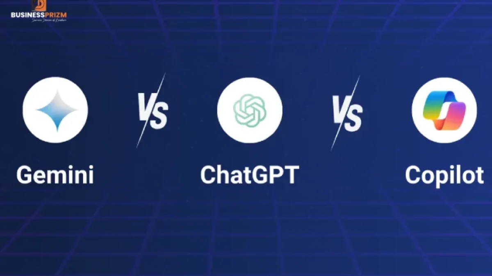
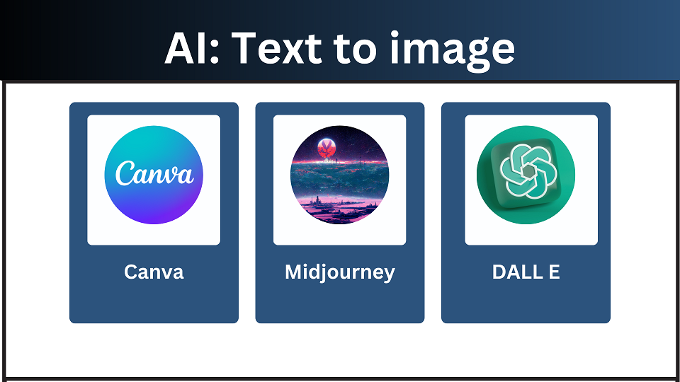
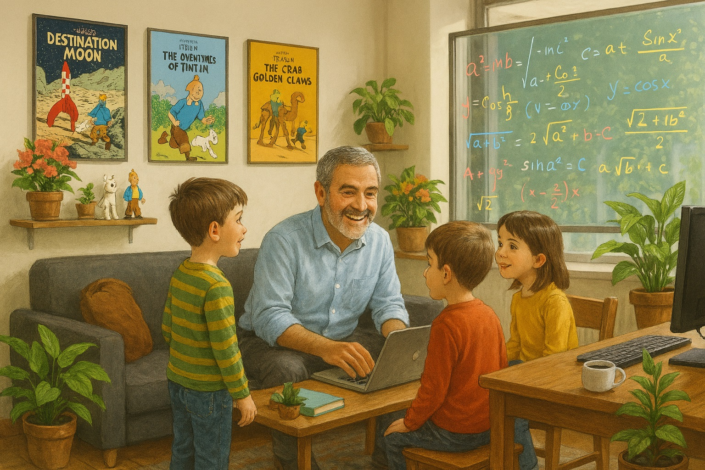
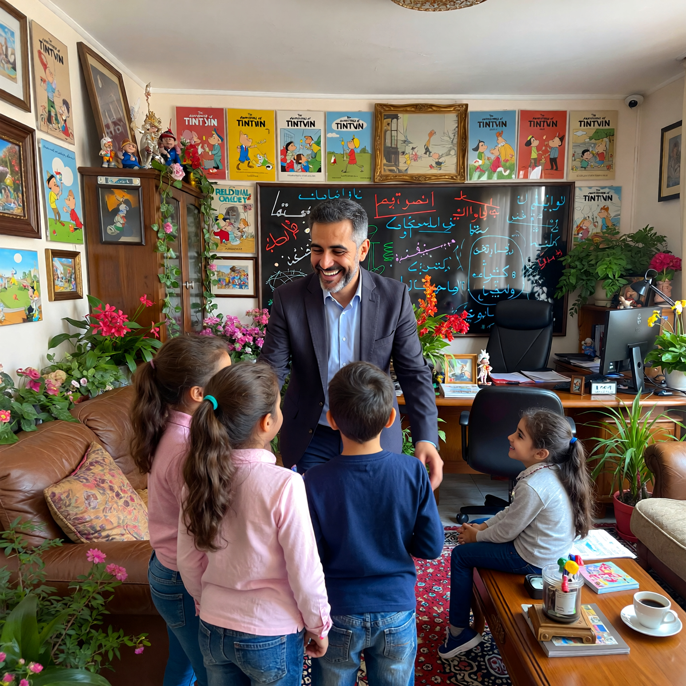
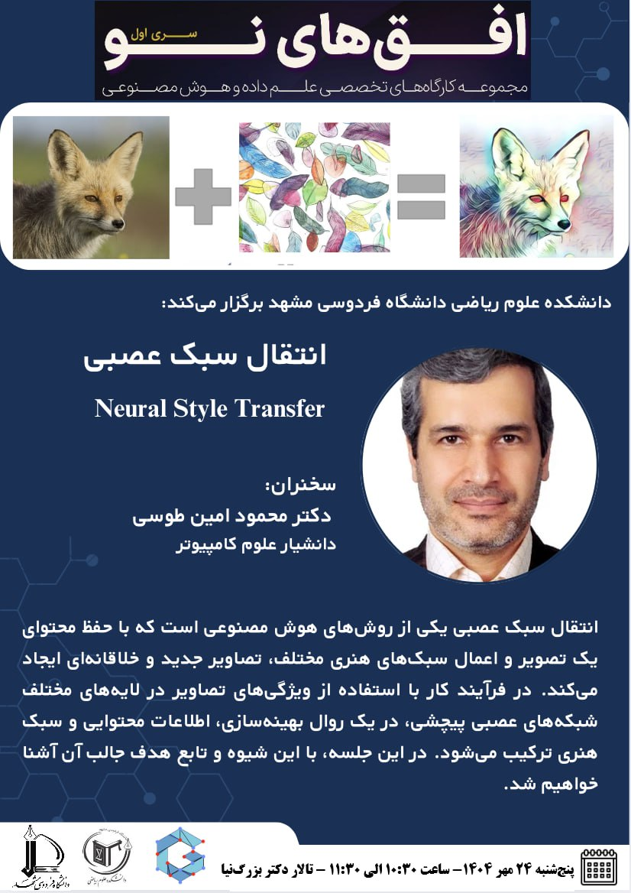
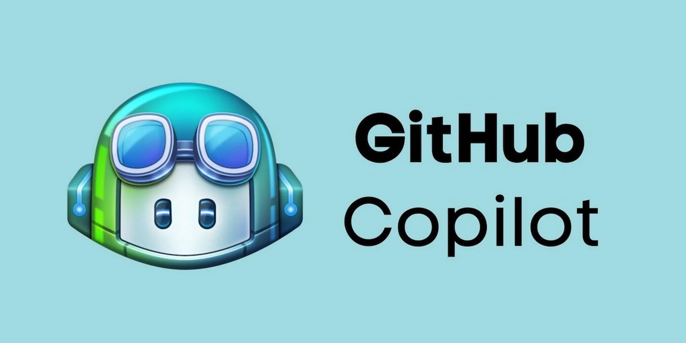
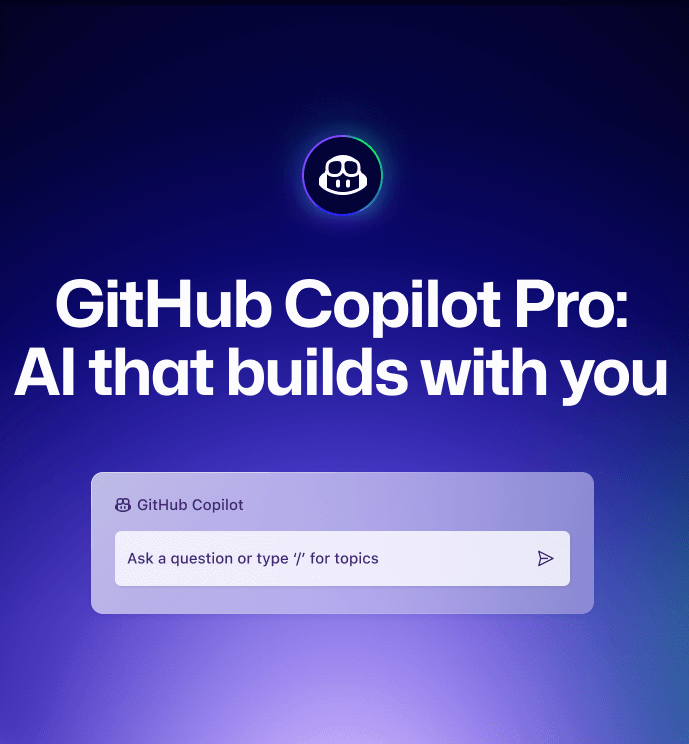
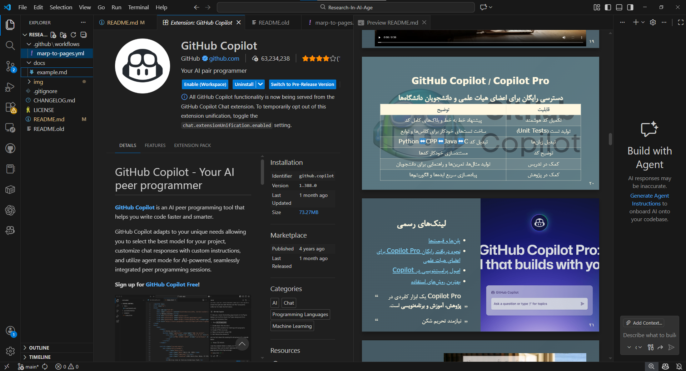
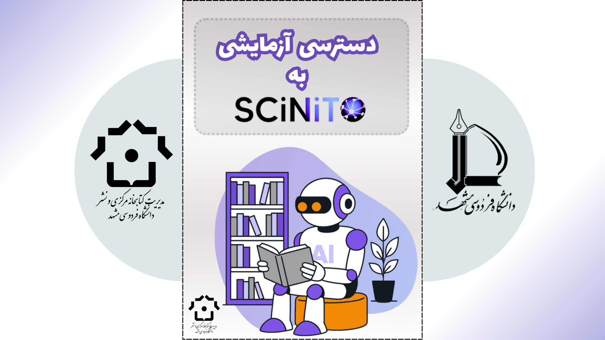

بسم الله الرحمان الرحیم

# پژوهش در عصر هوش مصنوعی

## فرصت‌ها و چالش‌ها

**دکتر محمود امین‌طوسی**
دانشکده علوم ریاضی - دانشگاه فردوسی مشهد

[mamintoosi.github.io](https://mamintoosi.github.io/)

<!-- _footer: گروه علوم کامپیوتر -->
<!-- _paginate: false -->

---

## سرفصل‌های ارائه

1. هوش مصنوعی مولد: انقلاب در پژوهش
2. ابزارهای هوش مصنوعی برای پژوهش
3. مهندسی پرامپت: کلید استفاده موثر
4. فرصت‌ها در علوم کامپیوتر
5. چالش‌ها و ملاحظات اخلاقی
6. بهترین شیوه‌ها

---

<!-- html -->
<div style="
  display: flex;
  justify-content: center;
  align-items: center;
  height: 80vh;
  margin: 0 auto;
">
  <video 
    autoplay 
    loop 
    muted 
    controls 
    style="
      max-height: 90%;
      width: auto;
      max-width: 90%;
      border-radius: 12px;
      box-shadow: 0 6px 20px rgba(0,0,0,0.25);
    ">
    <source src="img/Classical-Academic-Researcher.mp4" type="video/mp4">
    مرورگر شما از تگ ویدئو پشتیبانی نمی‌کند.
  </video>
</div>

---


# بخش اول

## هوش مصنوعی مولد: انقلاب در پژوهش

---


| گذشته:            | امروز:                  |
| :---------------- | :---------------------- |
| جستجو در Google   | دستیارهای هوشمند پژوهشی |
| مطالعه صدها مقاله | خلاصه‌سازی خودکار       |
| نگارش دستی        | کمک در نگارش و ویرایش   |
| کدنویسی از صفر    | تولید کد با AI          |

<style scoped>
table {
  width: 45%;
  margin: 0rem auto;
  border-collapse: separate;
  border-spacing: 30px;
  border: none;
}
th {
  text-align: center !important;
  font-size: 1.5em;
  border-bottom: 2px solid #333;
  padding-bottom: 1px;
}
td {
  text-align: right;
  vertical-align: top;
  border: none !important;
  padding: 1px;
}
td:first-child {
  border-left: 3px solid #888;
}
td:last-child {
  border-right: 3px solid #888;
}
</style>

---


## تمام تصاویر و ویدئوهای این ارائه که در آن تصویر اینجانب آمده است با هوش مصنوعی مولد و فقط با دادن این عکس و دستور متنی تولید شده‌اند

---


## هوش مصنوعی مولد چیست؟

- **تعریف:** مدل‌هایی که یاد می‌گیرند محتوای جدید «خلق» کنند

  - مانند یک نویسنده، نقاش، یا برنامه‌نویس

- **مدل‌های محبوب:**
  - ChatGPT (OpenAI)
  - Claude (Anthropic)
  - Gemini (Google)
  - DeepSeek (چین)

---



## مدل‌های «تولید متن از متن» (Text → Text)

| نمونه                                              | کاربرد اصلی                | وب‌سایت   |
| -------------------------------------------------- | -------------------------- | --------- |
| [ChatGPT](https://chatgpt.com)                     | گفتگو، کدنویسی، نگارش علمی | OpenAI    |
| [Claude](https://claude.ai)                        | تحلیل عمیق، استدلال متنی   | Anthropic |
| [Gemini](https://gemini.google.com)                | چندوجهی، جستجوی هوشمند     | Google    |
| [DeepSeek](https://chat.deepseek.com)              | استدلال و کدنویسی          | DeepSeek  |
| [Microsoft Copilot](https://copilot.microsoft.com) | دستیار برنامه‌نویسی و آفیس | Microsoft |

> این گروه، ستون فقرات ابزارهای پژوهشی مبتنی بر LLM محسوب می‌شود.

---



## تولید تصویر از متن — (Text → Image)

| ابزار                                         | کاربرد / ویژگی                           |
| --------------------------------------------- | ---------------------------------------- |
| [Imagine.art](https://www.imagine.art)        | تولید تصویر فوری، رایگان، مدل‌های تعاملی |
| [Text to Image](https://www.texttoimage.org/) | رایگان                                   |
| [Canva AI](https://www.canva.com)             | تولید سریع تصویر + ابزار طراحی           |
| [Leonardo AI](https://www.leonardo.ai)        | تصویرسازی هنری / مفهومی                  |
| [Dream by Wombo](https://dream.ai/)           | تولید تصویر با سبک‌های هنری              |

---

یک متن فارسی در مورد ترکیبی از خصوصیات سه تن از اساتید را به کوپایلوت دادم و پرامپت مناسب به زبان انگلیسی خواستم که این شد:

###### A cheerful middle-aged professor (around 45 years old) with short beard and salt-and-pepper hair, smiling warmly in his office at Ferdowsi University of Mashhad. His office is decorated with Tintin posters, figurines, and memorabilia, along with many flowers and green plants. A large glass blackboard, gifted by his students, is mounted on the wall, covered with colorful mathematical formulas written in marker. Several students are gathered around him, engaged in lively discussion, showing their admiration for his love of teaching. The office also contains a sofa, desk, chairs, computer, and coffee, creating a cozy and intellectual atmosphere full of energy and inspiration.

---

## خروجی کوپایلوت با GPT-5



---

## خروجی imagine.art با Nano-Banana-Pro



---



## مقایسه دو ابزار رایگان تولید تصویر با AI

- GPT-5 vs Nano Banana Pro
- تفاوت در واقع‌گرایی، وضوح، سبک هنری
- مناسب برای کدام کاربرد؟ (پوستر، ارائه، مقاله، تصویرسازی مفهومی)
- برای اطلاعات بیشتر در مورد شیوه تقلید یک اثر هنری در نقاشی ارائه‌ی قبلی با عنوان [انتقال سبک عصبی](https://1drv.ms/p/c/31166a0f5c94f268/EWjylFwPahYggDGCUwAAAAAB8JI2ARAES9QukZKKiM_EHw?e=qsdToe) را ملاحظه فرمایید

---


---

## تبدیل تصویر به تصویر (Image → Image)


| ابزار                                                          | کاربرد / ویژگی                            |
| -------------------------------------------------------------- | ----------------------------------------- |
| [Fotor AI](https://www.fotor.com/features/ai-image-generator/) | روتوش، حذف اشیاء، تبدیل سبک عکس           |
| [Photopea](https://www.photopea.com)                           | ویرایشگر آنلاین رایگان با فیلترهای هوشمند |
| [Canva AI](https://www.canva.com)                              | تغییر خودکار سبک، پس‌زمینه، رنگ‌ها        |
| [Pixlr AI](https://pixlr.com)                                  | اصلاح و انتقال سبک                        |

<!-- > این ابزارها برای ترمیم، تغییر سبک و بهبود کیفیت تصاویر موجود مناسب‌اند. -->

---


## تولید ویدئو از متن (Text → Video)

| ابزار                                                        | کاربرد / ویژگی                                     |
| ------------------------------------------------------------ | -------------------------------------------------- |
| [MovieFlow](https://movieflow.ai/signup?inviteCode=ZCKDT14H) | تولید ویدئوهای کوتاه با استایل سینمایی، پلن رایگان |
| [Hailuo AI Video](https://hailuoai.video/)                   | تولید سریع ویدئو از متن، نسخه رایگان دارد          |
| [Luma AI (Dream Machine)](https://lumalabs.ai/dream-machine) | حرکت طبیعی دوربین و اجسام، نسخه رایگان محدود       |
| [Runway Gen-2](https://runwayml.com)                         | تولید ویدئو از متن/عکس، نسخه رایگان محدود          |
| [Pika](https://www.pika.art)                                 | ویدئوهای کوتاه خلاقانه، پلن رایگان                 |
| [Kapwing AI Video](https://www.kapwing.com/ai)               | ساخت کلیپ از متن، ابزارهای ویرایش رایگان           |

<!-- > ابزارهای Text→Video به سرعت در حال پیشرفت‌اند و برای آموزش، پرزنتیشن و تولید محتوای علمی بسیار مناسب شده‌اند. -->

<!-- ---

به عنوان جزیی از موضوع، به نحوه ایجاد همین اسلایدها اشاره می شود

دسته بندی انواع مدلهای زبانی از نظر توانایی های مختلف

https://movieflow.ai/signup?inviteCode=ZCKDT14H

---


 -->

<!-- ---
| | |
|:---:|:---:|
|  |  | -->

---

<!-- html -->
<div style="
  display: flex;
  justify-content: center;
  align-items: center;
  height: 80vh; /* یا 85vh */
  margin: 0 auto;
">
  <div style="
    width: 80%; /* یا 80% */
    text-align: center;
  ">
    <video 
      controls 
      style="
        width: 100%;
        height: 70vh; 
        border-radius: 12px;
        box-shadow: 0 6px 20px rgba(0,0,0,0.25);
        background: #000; 
        object-fit: contain; 
      ">
      <source src="img/Research-Accelerator.mp4" type="video/mp4">
      مرورگر شما از تگ ویدئو پشتیبانی نمی‌کند.
    </video>
  </div>
</div>

<!-- <iframe src="https://example.com"></iframe>

---

<iframe src="http://koaning.io/fluctuating-repetition.html" height="300px" width="100%" frameBorder="0"></iframe> --> -->

---


# برای تولید ویدئو باید با استفاده از مدلهای زبانی سناریو نوشته شود.

---

<!-- html -->
<div style="
  display: flex;
  justify-content: center;
  align-items: center;
  height: 80vh; /* یا 85vh */
  margin: 0 auto;
">
  <div style="
    width: 80%; /* یا 80% */
    text-align: center;
  ">
    <video 
      controls 
      style="
        width: 100%;
        height: 70vh; 
        border-radius: 12px;
        box-shadow: 0 6px 20px rgba(0,0,0,0.25);
        background: #000; 
        object-fit: contain; 
      ">
      <source src="img/one-year.mp4" type="video/mp4">
      مرورگر شما از تگ ویدئو پشتیبانی نمی‌کند.
    </video>
  </div>
</div>

---

<!-- html -->
<div style="
  display: flex;
  justify-content: center;
  align-items: center;
  height: 80vh; /* یا 85vh */
  margin: 0 auto;
">
  <div style="
    width: 80%; /* یا 80% */
    text-align: center;
  ">
    <video 
      controls 
      style="
        width: 100%;
        height: 70vh; 
        border-radius: 12px;
        box-shadow: 0 6px 20px rgba(0,0,0,0.25);
        background: #000; 
        object-fit: contain; 
      ">
      <source src="img/From-Traditional-Research-to AI-Powered-Acceleration.mp4" type="video/mp4">
      مرورگر شما از تگ ویدئو پشتیبانی نمی‌کند.
    </video>
  </div>
</div>

---


## مدل‌های چندوجهی — Multimodal AI Models

### ورودی/خروجی: متن، تصویر، صوت، ویدئو

| مدل                                                      | توانایی / ویژگی کلیدی                        |
| -------------------------------------------------------- | -------------------------------------------- |
| [GPT-4o](https://chatgpt.com)                            | متن + تصویر + صوت؛ مکالمه چندحالته           |
| [Gemini 1.5](https://gemini.google.com)                  | پردازش متن، تصویر، صوت و ویدئو در مقیاس بزرگ |
| [Claude 3](https://claude.ai)   | تحلیل متن و تصویر با دقت بالا                |
| [Ollama Models](https://ollama.com/library)              | اجرای مدل‌های متن‌باز (LLM / VLM) روی لپ‌تاپ |
| [HuggingFace Multimodal](https://huggingface.co/unsloth) | مجموعه‌ای از مدل‌های رایگان متن-باز          |

> مدل‌های چندوجهی مسیر حرکت به سوی [هوش جامع مصنوعی](https://fa.wikipedia.org/wiki/%D9%87%D9%88%D8%B4_%D8%AC%D8%A7%D9%85%D8%B9_%D9%85%D8%B5%D9%86%D9%88%D8%B9%DB%8C) (AGI-like) را نشان می‌دهند.

---



## GitHub Copilot / Copilot Pro

### دسترسی رایگان برای اعضای هیات علمی و دانشجویان دانشگاه‌ها

| قابلیت                 | توضیح                                             |
| ---------------------- | ------------------------------------------------- |
| تکمیل کد هوشمند        | پیشنهاد خط به خط و بلاک‌های کامل کد               |
| تولید تست (Unit Tests) | ساخت تست‌های خودکار برای کلاس‌ها و توابع          |
| تبدیل زبان‌ها          | تبدیل کد Python↔CPP↔Java↔C                        |
| توضیح کد               | مستندسازی خودکار کدها                             |
| کمک در تدریس           | تولید مثال‌ها، تمرین‌ها و راهنمایی برای دانشجویان |
| کمک در پژوهش           | پیاده‌سازی سریع ایده‌ها و الگوریتم‌ها             |

---



## لینک‌های رسمی

- [پلن‌ها و قیمت‌ها](https://docs.github.com/en/copilot/get-started/plans)
- [نحوه دریافت رایگان Copilot Pro برای اعضای هیات علمی](https://docs.github.com/en/copilot/how-tos/manage-your-account/get-free-access-to-copilot-pro)
- [اصول پرامپت‌نویسی در Copilot](https://docs.github.com/en/copilot/concepts/prompting/prompt-engineering)
- [بهترین روش‌های استفاده](https://docs.github.com/en/copilot/get-started/best-practices)

> Copilot Pro یک ابزار کابردی در **پژوهش، آموزش و برنامه‌نویسی** است.

> نیازمند تحریم شکن

---



## VSCode

---

<!-- html -->
<div style="
  display: flex;
  gap: 30px;
  justify-content: center;
  align-items: center;
  height: 70vh;
">
  <div style="width: 45%; text-align: center;">
    <video 
      autoplay 
      loop 
      muted 
      controls
      style="
        width: 100%;
        height: 60vh;
        border-radius: 10px;
        box-shadow: 0 5px 15px rgba(0,0,0,0.2);
      ">
      <source src="img/Academic_Seasons_Research_Flow.mp4" type="video/mp4">
    </video>
    <div style="margin-top: 10px;"><strong>گذشته</strong></div>
  </div>
  
  <div style="width: 45%; text-align: center;">
    <video 
      autoplay 
      loop 
      muted 
      controls
      style="
        width: 100%;
        height: 60vh;
        border-radius: 10px;
        box-shadow: 0 5px 15px rgba(0,0,0,0.2);
      ">
      <source src="img/AI_Research_Workflow.mp4" type="video/mp4">
    </video>
    <div style="margin-top: 10px;"><strong>امروز</strong></div>
  </div>
</div>

---


## ابزارهای هوش مصنوعی برای پژوهش علمی  
### از جستجو تا مستندسازی و نگارش مقاله

| ابزار | کاربرد اصلی |
|------|-------------------------------|
| [Scinito](https://scinito.ai/) | جست‌وجوی دقیق علمی، یافتن مقالات مرتبط |
| [NotebookLM](https://notebooklm.google.com/) | ساخت مدل زبانی اختصاصی از PDFها و یادداشت‌های پژوهشی |
| [Gemini](https://gemini.google.com/) | تحلیل فایل‌های PDF، استدلال علمی، جستجو |
| [Connected Papers](https://www.connectedpapers.com/) | شبکه استنادی و یافتن مقاله‌های مشابه |
| [Elicit](https://elicit.com/) | مرور ادبیات (Literature Review) نیمه‌خودکار |

> این ابزارها چرخه پژوهش—from idea to publication—را سرعت می‌بخشند.

---



[UM Library](https://library.um.ac.ir/index.php/fa/news-archive-fa/scinito-videos)

[SciNiTO](https://www.scinito.ai/)

---

<!-- html -->
<div style="
  display: flex;
  justify-content: center;
  align-items: center;
  height: 80vh; /* یا 85vh */
  margin: 0 auto;
">
  <div style="
    width: 80%; /* یا 80% */
    text-align: center;
  ">
    <video 
      controls 
      style="
        width: 100%;
        height: 70vh; 
        border-radius: 12px;
        box-shadow: 0 6px 20px rgba(0,0,0,0.25);
        background: #000; 
        object-fit: contain; 
      ">
      <source src="https://library.um.ac.ir/images/Education/Tutorial_Videos/SCINITOAI/SCiNiTO%20AI-5%20Research%20Chatbot.mp4" type="video/mp4">
      مرورگر شما از تگ ویدئو پشتیبانی نمی‌کند.
    </video>
  </div>
</div>

---

مثالهایی که باید اضافه کنم:

- جستجوی لیست اعضای گروه علوم کامپیوتر در موتورهای جستجو و مدلهای زبانی
- هر ابزاری برای جایی
  - پاورپوینت، لاتک، HTML, Jupyer-book, Marp, Google docs
  - همین ارائه و ارائه های قبلی
- تبدیل ارائه NST‌ به مقاله
- نوشتن پیش نویس مقاله تخمین تابع چگالی احتمال
- استنتاج ریاضی: فرمول Image Matting
- شکن و ...
- مارک داون

---

با ارسال تصویر کارت دانشگاه حساب کاربری من در گیت هاب کوپایلوت که معمولی بود، Pro شد 🤩 و محدودیت ۵۰ چت رو دیگه ندارم

---

# بخش دوم

## ابزارهای هوش مصنوعی برای پژوهش

---

## ابزارهای جستجو و مطالعه

### 🔍 **Consensus.app**

- جستجوی مبتنی بر شواهد علمی
- خلاصه‌سازی یافته‌های پژوهشی
- [consensus.app](https://consensus.app/)

### 📚 **Elicit.com**

- دستیار پژوهش هوشمند
- استخراج اطلاعات از مقالات
- [elicit.com](https://elicit.com/)

---

## ابزارهای جستجو و مطالعه (ادامه)

### 🕸️ **Connected Papers**

- شبکه‌سازی مقالات مرتبط
- یافتن مقالات کلیدی
- [connectedpapers.com](https://www.connectedpapers.com/)

### 📖 **SciNiTO**

- منابع آکادمیک متنوع
- دسترسی به مقالات

---

## ابزارهای نگارش و ویرایش

### ✍️ **Editage**

- ویرایش و بهبود متن علمی
- پیشنهادات دستوری و سبکی
- [app.editage.com](https://app.editage.com/)

### 💻 **GitHub Copilot**

- کمک به کدنویسی
- رایگان برای دانشجویان و محققان
- [docs.github.com/copilot](https://docs.github.com/en/copilot)

---

## دموی زنده

### بیایید با هم امتحان کنیم:

- جستجوی یک موضوع در **Consensus**
- استفاده از **ChatGPT** برای خلاصه‌سازی یک مقاله

---

# بخش سوم

## مهندسی پرامپت: کلید استفاده موثر

---

## چرا پرامپت‌نویسی مهم است؟

### 🎯 پرامپت = دستورالعمل شما برای AI

- **دقت خروجی:** پرامپت خوب = پاسخ دقیق و مفید
- **کنترل نتیجه:** شما «مهندس» گفتگو هستید
- **بهینه‌سازی:** پرامپت ضعیف = پاسخ بی‌ربط

---

## مقایسه: پرامپت ضعیف vs قوی

### ❌ پرامپت ضعیف:

```
یک شعر بنویس
```

### ✅ پرامپت قوی:

```
یک شعر چهار بیتی درباره پاییز بنویس.
سبک: کلاسیک فارسی (شبیه حافظ)
موضوع: زیبایی طبیعت و گذر زمان
لحن: عاشقانه و حزن‌آلود
```

---

## چارچوب پرامپت حرفه‌ای

### **P**ersona (شخصیت)

هوش مصنوعی چه نقشی دارد؟

> "تو یک محقق متخصص در یادگیری ماشین هستی"

### **C**ontext (زمینه)

اطلاعات پیش‌زمینه چیست؟

> "در حال نگارش بخش Related Work مقاله‌ام درباره CNN"

### **T**ask (وظیفه)

چه کاری باید انجام شود؟

> "فهرستی از ۱۰ مقاله کلیدی در این حوزه ارائه بده"

---

## چارچوب پرامپت (ادامه)

### **F**ormat (قالب)

خروجی چگونه باشد؟

> "نتیجه را به صورت جدول LaTeX ارائه بده"

### **T**one (لحن)

لحن خروجی چگونه باشد؟

> "با لحنی علمی، رسمی و دقیق"

### **E**xemplar (نمونه) - اختیاری

مثالی برای تقلید وجود دارد؟

> چند نمونه ورودی/خروجی ارائه دهید (Few-shot learning)

---

## مثال کاربردی: نگارش مقاله

```
[Persona] تو یک محقق باتجربه در علوم کامپیوتر هستی
که در زمینه پردازش تصویر تخصص داری.

[Context] من در حال نگارش بخش Introduction مقاله‌ام
درباره "تشخیص اشیا با CNN" هستم.

[Task] یک پاراگراف ۱۰۰ کلمه‌ای بنویس که اهمیت
این موضوع را توضیح دهد.

[Format] خروجی به صورت متن ساده، بدون فرمت‌بندی خاص

[Tone] لحن علمی و رسمی، مناسب برای مجله معتبر
```

---

## تکنیک‌های پیشرفته

### 1️⃣ **Chain of Thought (زنجیره تفکر)**

از AI بخواهید گام‌به‌گام فکر کند:

```
"قبل از پاسخ نهایی، استدلال خود را مرحله‌به‌مرحله
توضیح بده."
```

### 2️⃣ **استفاده از جداکننده‌ها (Delimiters)**

```
متن زیر را خلاصه کن:
"""
[متن شما اینجا]
"""
```

---

## تکنیک‌های پیشرفته (ادامه)

### 3️⃣ **Few-shot Learning**

چند مثال ارائه دهید:

```
جمله: "این فیلم عالی بود" → احساس: مثبت
جمله: "خیلی خسته‌کننده بود" → احساس: منفی
جمله: "قابل قبول بود" → احساس: خنثی

حالا این جمله را تحلیل کن:
"تحقیقات جالبی ارائه شده است"
```

### 4️⃣ **توسعه تکراری**

پرامپت را آزمایش کنید → بهبود دهید → دوباره امتحان کنید

---

## دموی عملی: پرامپت نویسی

### بیایید با هم یک پرامپت بنویسیم:

**هدف:** کمک به نگارش بخش Abstract یک مقاله

---

# بخش چهارم

## فرصت‌های AI در علوم کامپیوتر

---

## 1. تسریع کدنویسی و دیباگینگ

### ابزارها:

- **GitHub Copilot** - تکمیل خودکار کد
- **Cursor** - ویرایشگر هوشمند
- **Codeium** - جایگزین رایگان

### مزایا:

✅ نوشتن سریع‌تر کد
✅ یافتن و رفع باگ‌ها
✅ پیشنهاد الگوریتم‌های بهینه
✅ تولید تست‌های واحد (Unit Tests)

---

## 2. پیش‌پردازش و تحلیل داده

### کاربردها:

- تولید خودکار کد تحلیل داده
- پیشنهاد روش‌های آماری مناسب
- تفسیر نتایج و نمودارها
- تولید کد Matplotlib/Seaborn

### مثال:

```
"کد Python بنویس که یک فایل CSV با ستون‌های
age, income, education بخواند و همبستگی بین
آنها را با heatmap نمایش دهد."
```

---

## 3. نگارش مقالات و گزارش‌ها

### کمک در بخش‌های مختلف:

- **Abstract:** خلاصه‌سازی پژوهش
- **Introduction:** بیان اهمیت موضوع
- **Related Work:** مرور مقالات مرتبط
- **Methodology:** توضیح روش‌ها
- **Results:** تفسیر نتایج

### توجه:

⚠️ همیشه ویرایش و راستی‌آزمایی کنید!

---

## 4. ترجمه و ویرایش متون علمی

### قابلیت‌ها:

- ترجمه دقیق متون تخصصی
- تصحیح گرامر و املا
- بهبود روان‌نویسی
- تنظیم لحن (رسمی/غیررسمی)

### مثال:

```
"این متن فارسی را به انگلیسی علمی و رسمی
ترجمه کن، مناسب برای مجله IEEE"
```

---

## 5. ایده‌پردازی و طوفان فکری

### کاربردها:

- تولید ایده‌های پژوهشی جدید
- بررسی شکاف‌های پژوهشی (Research Gaps)
- پیشنهاد ترکیب روش‌های مختلف
- شناسایی روندهای نوظهور

### مثال:

```
"در حوزه NLP چه موضوعات کم‌کار شده‌ای وجود دارد
که برای یک رساله دکتری مناسب باشد؟"
```

---

# بخش پنجم

## ابزارهای تولید کلپپ

- [](https://hailuoai.video/)
- [](https://pika.art/)

---

# بخش ششم

## چالش‌ها و ملاحظات اخلاقی

---

## 1. توهم‌زایی (Hallucination)

### ⚠️ مشکل:

- AI ممکن است اطلاعات غلط یا ساختگی تولید کند
- منابع و ارجاعات جعلی
- آمار و ارقام نادرست

### ✅ راه‌حل:

- **همیشه راستی‌آزمایی کنید**
- منابع را دوباره بررسی کنید
- از چند منبع استفاده کنید
- به AI اعتماد کورکورانه نداشته باشید

---

حتی نتایج گوگل هم ممکن است اشتباه باشد!


---

|                                              |                                                |
| :------------------------------------------: | :--------------------------------------------: |
|  |  |

---

## 2. حریم خصوصی و امنیت

### 🚫 چیزهایی که نباید وارد کنید:

- اطلاعات شخصی و محرمانه
- کدهای حساس و اختصاصی
- داده‌های بیمار یا شرکت
- نتایج منتشر نشده

### ✅ راه‌حل:

- استفاده از نسخه‌های Enterprise
- اجرای مدل‌های محلی (Local LLMs)
- حذف اطلاعات حساس قبل از ورود

---

## 3. سرقت ادبی (Plagiarism)

### ⚠️ خطرات:

- استفاده مستقیم از خروجی AI بدون ویرایش
- عدم ذکر کمک AI در مقالات
- نقض قوانین مجلات و کنفرانس‌ها

### ✅ راه‌حل:

- **AI را ابزار کمکی ببینید، نه جایگزین**
- محتوای تولیدشده را بازنویسی کنید
- در صورت لزوم، کمک AI را ذکر کنید
- اصالت و خلاقیت خود را حفظ کنید

---

## 4. وابستگی بیش از حد

### ⚠️ مشکل:

- کاهش تفکر انتقادی
- از دست دادن مهارت‌های پایه
- عدم درک عمیق موضوع

### ✅ راه‌حل:

- AI ابزار است، نه جایگزین محقق
- از AI برای **یادگیری** استفاده کنید
- مفاهیم را خودتان درک کنید
- تفکر انتقادی را حفظ کنید

---

## 5. تعصبات (Bias) در مدل‌ها

### ⚠️ مشکل:

- مدل‌ها بر اساس داده‌های موجود آموزش دیده‌اند
- ممکن است تعصبات فرهنگی، جنسیتی یا نژادی داشته باشند
- محدودیت در دانش (تاریخ قطع آموزش)

### ✅ راه‌حل:

- آگاه از محدودیت‌ها باشید
- نتایج را با دید انتقادی بررسی کنید
- از منابع متنوع استفاده کنید

---

# بخش ششم

## بهترین شیوه‌ها (Best Practices)

---

## توصیه‌های کلیدی

### ✅ **برای یادگیری استفاده کنید**

- از AI بخواهید مفاهیم را «توضیح» دهد
- گام‌به‌گام یاد بگیرید
- برای ایده‌پردازی عالی است

### ✅ **همیشه راستی‌آزمایی کنید**

- منابع را بررسی کنید
- اطلاعات را تایید کنید
- به یک منبع بسنده نکنید

---

## توصیه‌های کلیدی (ادامه)

### ✅ **حریم خصوصی را رعایت کنید**

- اطلاعات حساس وارد نکنید
- از نسخه‌های امن استفاده کنید

### ✅ **توسعه تکراری پرامپت**

- پرامپت را آزمایش کنید
- بهبود دهید
- دوباره امتحان کنید

---

## منابع رایگان

### 🎓 **دسترسی رایگان GitHub Copilot:**

- برای دانشجویان و اساتید
- [github.com/education](https://docs.github.com/en/copilot/get-started/plans)

### 📚 **آموزش‌های رایگان:**

- دوره‌های مکتب‌خونه
- مستندات GitHub Copilot
- دوره‌های Coursera و edX

### 🔗 **لینک‌های مفید:**

در اسلایدهای قبلی ذکر شد

---

# جمع‌بندی

---

## نکات کلیدی

1. **هوش مصنوعی ابزاری قدرتمند است** که می‌تواند پژوهش را تسریع کند
2. **مهندسی پرامپت** کلید استفاده موثر از AI است
3. **فرصت‌های زیادی** در کدنویسی، تحلیل داده، و نگارش وجود دارد
4. **چالش‌های اخلاقی** جدی هستند و باید مدیریت شوند
5. **راستی‌آزمایی** و **تفکر انتقادی** ضروری است

---

## پیام نهایی

### 🎯 **AI را به عنوان دستیار ببینید، نه جایگزین**

- خلاقیت و تفکر انتقادی شما جایگزین‌ناپذیر است
- از AI برای تسریع و بهبود کار خود استفاده کنید
- مسئولیت‌پذیری و اخلاق را فراموش نکنید
- با آزمایش و یادگیری شروع کنید

---

# پرسش و پاسخ

**دکتر محمود امین‌طوسی**

[mamintoosi.github.io](https://mamintoosi.github.io/)
[mamintoosi.github.io/presentations](https://mamintoosi.github.io/presentations/)

با تشکر از توجه شما 🙏

---

## منابع و لینک‌های مفید

- Consensus: https://consensus.app/
- Elicit: https://elicit.com/
- Connected Papers: https://www.connectedpapers.com/
- Editage: https://app.editage.com/
- GitHub Copilot: https://docs.github.com/en/copilot
- DeepSeek: https://chat.deepseek.com/
- ChatGPT: https://chatgpt.com/

**این اسلاید‌ها:** [لینک گیت‌هاب شما]
